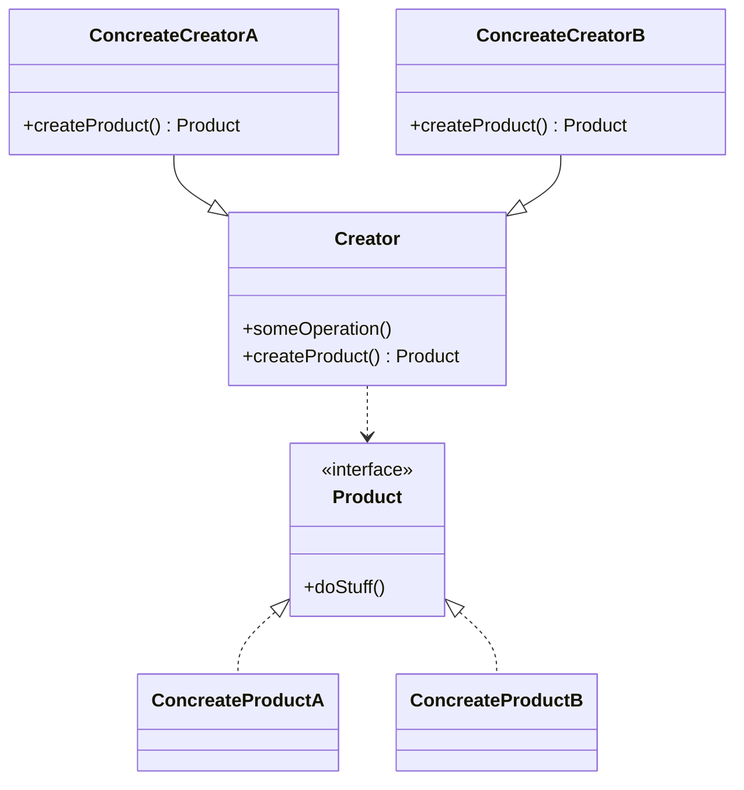

#### 1.工厂方法 *virtual constructor、factory method*
**问题**：物流应用初版只能处理卡车运输，因此大部分代码都在*Truck*类中。后期版本要接入新的海运公司，要支持新的运输方式。目前大部分代码都与*Truck*类相关。在程序中添加*Ship*类需要修改全部代码。后续版本中可能新增新的运输方式，这样大幅度修改将产生冗余代码。
**解决方案**：工厂方法模式建议使用特殊的**工厂***factory*方法替代对对象构造函数的直接调用。**注意**:仅当这些产品具有共同的基类或者接口时，子类才能返回不同类型的产品，同时基类中的工厂方法还应将其返回类型声明为这一公共的接口， 即为：多态。
### 结构图

### 伪代码
```pseudocode
// 创建者类声明的工厂方法返回一个抽象的产品类对象，创建者的子类会提供
// 该方法的实现。
class Dialog is
    // 提供的工厂方法--抽象方法
	abstract method createButton():Button
	// 创建者的主要职责并非是创建产品。其中通常包含一些核心业务逻辑
	// 这些逻辑依赖于工厂返回的产品对象。子类可通过重写工厂方法
	// 并使其返回不同类型的产品来间接修改业务逻辑
    method render() is
    	// 调用工厂方法创建一个产品对象
    	Button okButton = createButton()
    	// 使用产品
    	okButton.onClick(closeDialog)
    	okButton.render()
// 具体创建者重写工厂方法改变其返回的产品类型
class WindowsDialog  extends Dialog is
	method createButton():Button is
		return new WindowsButton()
class WebDialog extends Dialog is 
	method createButton():Button is
		return new HTMLButton()
// 产品接口声明所有具体产品都必须实现的操作
interface Button is
	method render()
	method onClick(f)
// 具体产品提供产品接口的具体实现
class WindowsButton implements Button is
	method render(a,b)is
		// 根据Windows样式渲染按钮
	mehtod onClick(f)is
		// 绑定本地操作系统点击事件
class HTMLButton implements Button is
	method render(a,b)is
		// 返回一个HTML按钮
	method onClick(f)is
		// 绑定还HTML点击事件
	
// 客户端调用
class ClientApplication is
	field dialog:Dialog
	// 根据配置动态选择创建者类型
	method initialize() is
		config = readApplicationConfig()
		if (config.OS =="Windows")then
			dialog = new WindowsDialog()
		else if (config.os =="Web")then
			dialog = new WebDialog()
		else 
			throw new Exception("不支持的类型")
	method main() is
		this.initialize()
		dialog.render()
```
### 使用场景
- **无法预知对象确切类别机器依赖关系**
	工厂方法将创建产品的代码与实际使用产品的代码分离，从而能在不影响其他代码的情况下扩展产品创建部分的代码。
- **希望用户扩展软件库或者框架的内部组件**
- **复用现有对象来节省系统资源，而不是每次创建新对象**
	- 服用对象的方法
		1. 首先，创建存储空间存放所有已经创建的对象
		2. 当他人请求一个对象时，程序在对象池中搜索可用对象
		3. 然后将其返回给调用者
		4. 如果没有可用对象，程序创建一个新的对象并将其添加到对象池中  	
### 实现方式
1. 所有产品都遵循同一接口。该接口中必须声明对所有产品都有意义的方法。
2. 在创建者类中定义一个空的工厂方法。该方法的返回类型是产品的接口对象
3. 在创建者代码中找到对于产品构造函数的所有引用。将它们一次替换为对与工厂方法的调用，同时将创建产品的代码移入工厂方法。你可能需要在工厂方法中添加临时变量来控制返回的产品类型。
4. 现在，为工厂方法中的每个产品编写一个创建者子类，然后在子类中重写工厂方法，并将基本方法中的相关创建代码移植到工厂方法中。
5. 如果应用中的产品种类太多，那么为每个产品创建子类并无太大必要，这时可以在子类中服用基类中的控制参数。
6. 代码经过上述移动后，基础控场方法中已没有任何代码，你可以将其变为抽象类。如果基础工厂方法中还有其他语句，你可以将其设置为该方法的默认行为。
### 工厂方法模式的优缺点
- **优点**
	- 避免创建者和具体产品间的紧密耦合
	- 单一职责原则。你可以将产品的创建代码放到单一位置，从而使得代码更容易维护。
	- 开闭原则。无需更改现有底层代码，就可以在系统中引入新的产品类型。 
- **缺点**
	- 应用工厂模式需要引入许多子类，代码变得更加复杂。 