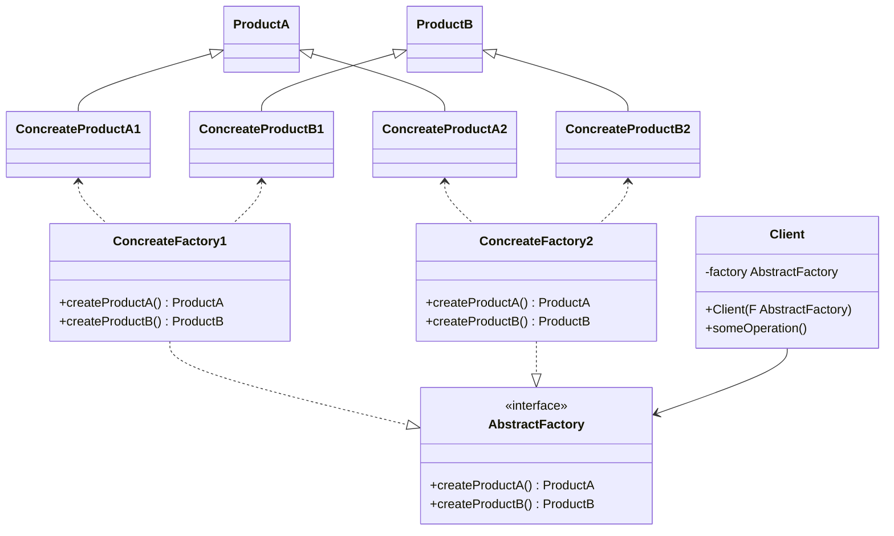

#### 2. 抽象工厂模式  *abstract factory*
**问题**：一款家具商店应用。系统中一些类：
	1. 一系列相关产品。例如：Chair Sofa CoffeeTable
	2. 一些列产品的变体。例如：Modern Victorian ArtDeco等风格的。
系统单独生成每件家具对象，保证风格一致。并且添加新产品或者新风格时不要修改已有代码。家具风格更新频繁，每次更新时都要修改核心代码时不合时宜的。
**解决方案**：首先，抽象工厂模式建议为系列中的每个产品明确声明接口。然后，所有产品变体继承这些接口。接下来，我们要声明抽象工厂(包含系列所有产品构造方法的接口)。对于系列产品的每个变体，我们都将基于抽象工厂接口创建不同的工厂类。每个工厂类返回指定类别的产品。客户端代码可以通过相应的抽象接口调用工厂和产品类。
**说明**：一般情况下，应用程序会在初始化阶段创建具体的工厂对象。此时应用程序必须根据*配置文件*或*环境设定*选择工厂类别。
**抽象工厂模式结构**

 **描述**
 	- 抽象产品*abstract product* :构成系列产品的一组不同但相关的产品接口
 	- 具体产品*concrete product* :抽象产品的多种不同类型实现。
 	- 抽象工厂*abstract factory* :接口声明了一组创建各种抽象产品的方法。
 	- 具体工厂*concrete factory* :实现抽象工厂的构建方法。每个具体工厂都对应特定产品变体，并且仅创建此种产品变体。
 	- 尽管具体工厂会对具体产品进行初始化，其构建方法签名必须返回相应的抽象产品。这样客户端在使用工厂类的时候就不会与具体产品耦合。客户端只需要通过抽象接口调用共产和产品对象，就能与任何具体工厂/产品变体交互。
 **伪代码**
 ```mermaid
 classDiagram
 	WinFactory ..|> GUIFactory
	MacFactory ..|> GUIFactory
	Application	-->GUIFactory
    WinButton <.. WinFactory
    WinCheckbox <.. WinFactory
    Button <|-- WinButton
    Checkbox <|-- WinCheckbox
    Button <|-- MacBotton
    Checkbox <|-- MacCheckbox
    MacBotton <.. MacFactory
    MacCheckbox <.. MacFactory
    class GUIFactory{
    	<<interface>>
    	+createButton() Button
    	+createCheckbox() Checkbox
    }
    class WinFactory{
    	+createButton() Button
    	+createCheckbox() Checkbox
    }
    class MacFactory{
    	+createButton() Button
    	+createCheckbox() Checkbox
    }
    class Application{
    	-factory GUIFactory
    	-button Button
    	+Application(F GUIFactory)
    	+createUI()
    	+paint()
    }
 ```

 ```pseudocode
 //抽象工厂接口：声明一组能返回不同抽线产品的方法。这些产品属于同一个系列并且
 //具有相关性。同系列产品通常能搭配使用。同系列产品可以搭配使用。系列产品可有多个
 //变体，但不同变体的产品不能搭配使用。
 interface GUIFactory is
 	method createButton():Button
 	method createCheckbox():Checkbox
 //具体共产生成属于同一变体的系列产品。具体工厂方法签名返回一个抽象产品，
 //方法内部返回具体产品。
 class WinFactory implements GUIFactory is
 	method createButton():Button is
 		return new WinButton()
 	method createCheckbox():Checkbox is
 		return new WinCheckbox()
 class MacFactory implements GUIFactory is
 	method createButton():Button is
 		return new MacButton()
 	method createCheckbox():Checkbox is
 		return new MacCheckbox()
 //系列产品中的特定产品必须有一个基础接口。所有产品变体都必须实现这个接口。
 interface Button is
 	method paint()
 class WinButton implements Button is
 	method paint() is
 		//根据Windows 样式渲染按钮
 class MacButton implements Button is
 	method paint() is
 		//根据Mac 样式渲染按钮
 interface Checkbox is 
 	method paint()
 class WinCheckbox implements Checkbox is
 	method paint() is
 		//根据 Windows 样式渲染多选框
 class MacCheckbox implements Checkbox is
 	method paint() is
 		//根据 mac 样式渲染多选框
 class Application is
 	private field factory:GUIFactory
 	private field button:Button
 	constructor Application(factory:GUIFactory) is
 		this.factory = factory
 	method createUI() is
 		this.button = factory.createButton()
 	method paint() is
 		button.paint()
 //程序会根据当前配置或者环境设定选择工厂类型，并在运行时创建工厂。
 class ApplicationConfigurator is 
 	method main() is
 		config = readApplicationConfigFile()
 		if(config.OS == "Windows") then
 			factory = new WinFactory()
 		else if(config.os == "Mac") then
 			factory = new MacFactory()
 		else 
 			throw new Exception("未知的操作系统")
 ```
 **抽象工厂模式应用场景**
  - 如果代码需要与多个不同系列的相关产品交互，但是无法提前获取信息，或者对未来扩产属性的考虑，不希望代码给予产品的具体类进行构建，这种场景下可以使用抽象工厂
  - 如果你又一个基于一组丑行方法的类，且主要功能因此变得不明确，那么在这种情况下可以考虑使用抽象工厂模式。
**实现方式**
 1. 以不同的产品类型与产品为维度绘制矩阵
 2. 为所有产品声明抽象产品接口。然后让所有具体产品类实现这些接口
 3. 声明抽象工厂接口，并在及口中为所有抽象产品提供一组构建方法。
 4. 为每种产品变体实现一个具体工厂类
 5. 在应用程序中开发初始化代码。改代码根据应用程序配置或当前环境，对特定具体工厂类进行初始化。然后将该工厂对象传递给所有需要创建产品的类。
 6. 找出代码中所有对产品构造函数的直接调用，将其替换为对工厂对象中相应构建方法的调用。
**抽象工厂模式优缺点**
- 可以确保同一工厂生成的产品相互匹配
- 避免客户端和具体产品代码的耦合
- 单一职责原则。可以将产品生成代码抽取到同一未知，使得代码易于维护。
- 开闭原则。向应用程序中引入新的产品变体时，无需修改客户端代码。