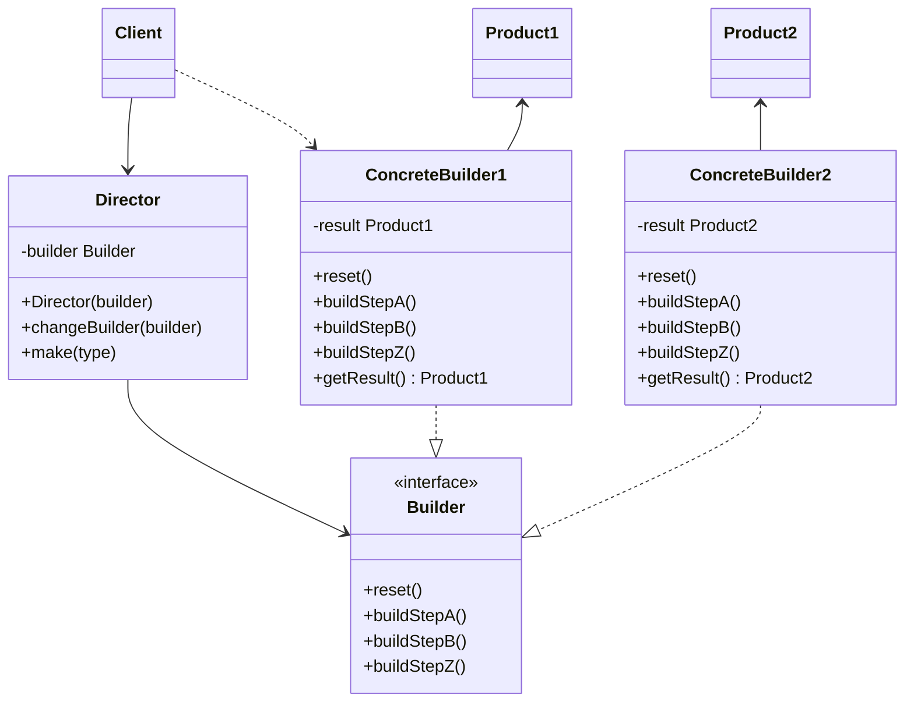

#### 3. 生成器模式 *builder*
**问题** 
	情景：有一个复杂对象，其内部进行构造时需要对诸多成员变量和嵌套对象进行复杂的初始化工作。初始化代码深藏于一个包含众多参数且让人基本看不懂的构造函数中，甚至还有更糟糕的情况，那就是这些代码散落在客户端多个位置。
	例如：创建一个**房屋** *House*对象。一个简单的房屋你需要建造四面墙和地板，安装房门和一套窗户，然后在建造一个屋顶。但是有的房屋还有院子，还有其他设施。
	这时有两种方法：一是扩展House基类，创建一系列含有所有组合的子类。但这时有大量的子类。任何新增参数都会让层次结构更加复杂。
	二是在House基类中创建一个包含尽可能所有参数的超级构造函数，并用它来控制房屋对象。这种方式能避免创建大量子类，但是又导致了另一个问题。通常情况下，绝大多数参数没有使用，这使得对于构造函数的调用十分不简洁。
**解决方案**：生成器模式建议将对象构造代码从产品类中抽取出来，并将其放在一个名为生成器的独立对象中。该模式会将对象的构造过程划分为一组步骤。每次创建对象时，你都需要通过生成器执行一系列步骤。重点在于你无需调用所有步骤，而只需调用创建特定对象配置所需要的那些步骤即可。
	当需要创建不同形式的产品时，其中的一些构造步骤可能需要不同的实现。例如:木屋，城堡。在这种情况下，可以创建多个不同的生成器，用不同的方式实现一组相同的创建步骤。然后就可以在创建过程中使用这些生成器来生成不同类型的对象。
**主管**：可以进一步将用于创建产品的一些列生成器抽取成为单独的主管类。主管类可以定义创建步骤的执行顺序，而生成器则提供这些步骤的实现。严格来说，程序中不一定需要主管类。客户端代码可以直接以特定顺序调用创建步骤。主管类非常适合放入各种理性构造流程，以便在程序中反复使用。对于客户端代码来说，主管类隐藏了产品构造细节。客户端只需要将一个生成器与主管类关联，然后使用主管类来构造产品，就能从生成器获得产品了。
**生成器模式结构**

 - **生成器** *builder* 声明所有类型生成器中通用的产品构造步骤
 - **具体生成器** *concrete builders* 提供构造过程的不同实现。
 - **产品** *products* 最终生成的对象。由不同生成器构造的产品无需属于同一类型层次结构
 - **主管** *director* 定义调用构造步骤的顺序。
 - **客户端** *client* 必须将某个生成器对象和主管类关联。
 **伪代码**
 ```mermaid
 classDiagram
 	Client -->Director
 	Client ..>CarBuilder
 	Budiler<--Director
 	CarBuilder..|>Builder
 	CarManualBuilder..|>Builder
 	CarBuilder -->Car
 	CarManualBuilder-->Manual
 	class Builder{
 		<<interface>>
 		+reset()
 		+setSeats(number)
 		+setEngine(engine)
 		+setTripComputer()
 		+setGPS()
 	}
 	class Director{
 		+makeSUV(builder)
 		+makeSportsCar(builder)
 	}
 	class CarBuilder{
 		-car Car
 		+reset()
 		+setSeats(number)
 		+setEngine(engine)
 		+setTripComputer()
 		+setGPS()
 		+getResult() Car
 		
 	}
 	class CarManualBuilder{
 		-manual Manual
 		+reset()
 		+setSeats(number)
 		+setEngine(engine)
 		+setTripComputer()
 		+setGPS()
 		+getResult() Manual
 	}
 ```
 ```pseudocode
 class Car is
 
 class Manual is
 
 interface Builder is
 	method reset()
 	method setSeats(...)
 	method setEngine(...)
 	method setTripComputer(...)
 	method setGPS(...)
 class CarBuilder implements Builder is
 	private field car:Car
 	constructor CarBuilder() is
 		this.reset()
 	method reset() is
 		this.car = new Car()
 	method setSeats(...)is
 		
 	method setEngine(...)is
 		
 	method setTripComputer(...)is
 		
 	method setGPS(...)is
 		
 	method getProduct():Car is
 		product = this.car
 		this.reset()
 		return product
 class CarManualBuilder implements Builder is
 	private field manual:Manual
 	constructor CarManualBuilder() is
 		this.reset()
 	method reset() is
 		this.manual = new Manual()
 	method setSeats(...) is
 		
 	method setEngine(...) is
 		
 	method setTripComputer(...) is
 		
 	method setGPS(...) is
 		
 	method getProduct():Manual is
 		product = this.manual
 		this.reset()
 		return product
 class Director is
 	private field builder:Builder
 	
 	method setBuilder(builder:Builder) is
 		this.builder = builder
 	method constructSportsCar(builder:Builder) is
 		builder.reset()
 		builder.setSeats(2)
 		builder.setEngine(new SportEngine)
 		builder.setTripComputer(true)
 		builder.setGPS(true)
 	method constructSUV(builder:Builder)is
 		
 class Application is
 	method makeCar()is
 		director = new Director()
 		
 		CarBuilder builder = new CarBuilder()
 		director.constructSportsCar(builder)
 		Car car = builder.getProduct()
 		
 		CarManualBuilder builder2 = new CarManualBuilder()
 		director.constructSportsCar(builder)
 		Manual manual = builder.getProduct()
 		
 ```
**生成器模式适用场景**
	- 使用生成器模式可以避免重叠构造函数出现
	- 希望使用代码创建不同形式的产品时，可以使用生成器模式
	- 使用生成器构造**组合**或者其他复杂对象
**实现方法**
	1. 清晰地定义通用步骤，确保他们可以制造所有形式的产品。
	2. 在基本生成器接口中声明这些步骤
	3. 为每个形式的产品创建具体生成器类，并实现器构造步骤。
	4. 考虑创建主管类，它可以使用同一生成器对象来封装多种构造产品的方式
	5. 客户端代码会同时创建生成器和主管对象。 构造开始前， 客户端必须将生成器对象传递给主管对象。 通常情况下， 客户端只需调用主管类构造函数一次即可。 主管类使用生成器对象完成后续所有制造任务。 还有另一种方式， 那就是客户端可以将生成器对象直接传递给主管类的制造方法。
	6. 只有在所有产品都遵循相同接口的其工况下，构造结果可以直接通过主管类获取。否则，客户端应当通过生成器获取构造结果。
**生成器模式优缺点**
 - 可以分布创建对象，暂缓创建步骤或者递归运行创建步骤
 - 生成不同形式的产品，可以复用相同的制造代码
 - 单一职责原则。可以将复杂的构造代码从产品的业务逻辑中分离出来