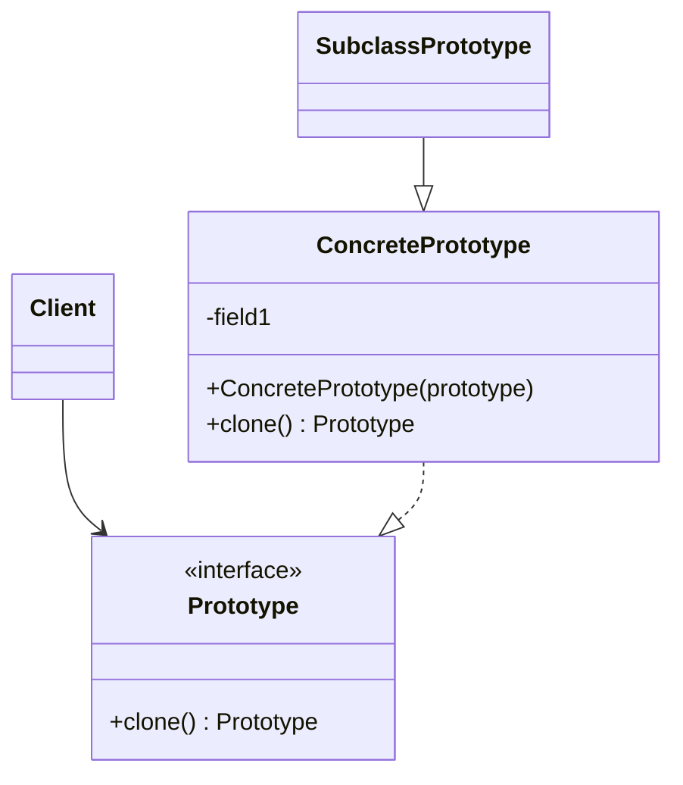
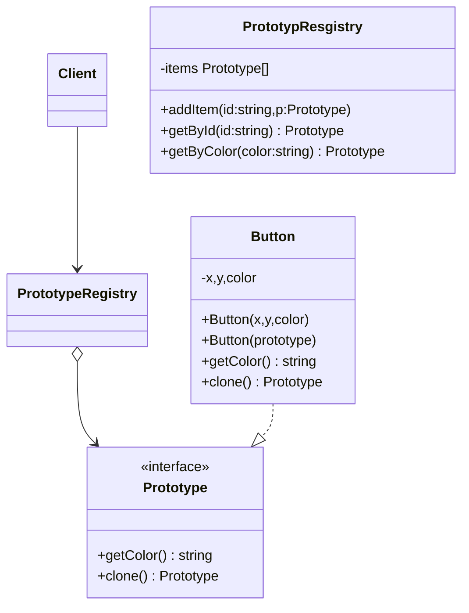
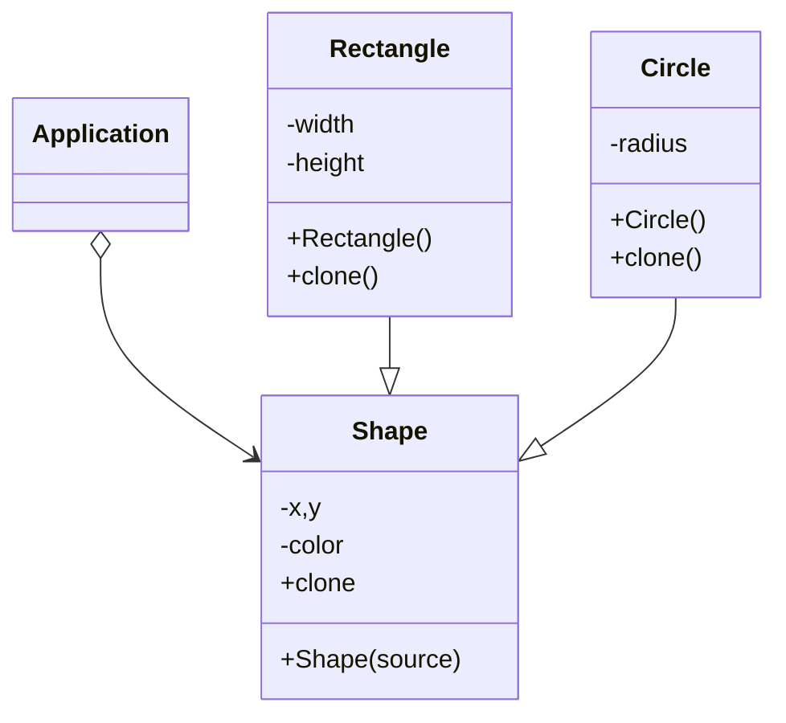

#### 4. 原型模式 *clone prototype*
**问题**
	情景：如果你想复制一个对象，那么该如何设计？首先，你必须新建一个属于相同类型的对象，然后遍历原始对象的所有成员变量，并将成员变量值复制到新对象中。
	上述方式有个问题，并非所有对象那个都能通过上述方式复制。因为由些对象可能拥有私有成员变量，他们在对象本身以外时不可见的。(java可以使用反射，其他语言呢?)。并且还有另一个问题，你必须知道对象所属的类才能创建复制品，所以代码必须依赖该类。即使你可以接受额外的依赖性， 那还有另外一个问题： 有时你只知道对象所实现的接口， 而不知道其所属的具体类， 比如可向方法的某个参数传入实现了某个接口的任何对象。
**解决方案**:原型模式将克隆过程委派给被克隆的实际对象。该模式为所有支持克隆的对象声明了一个通用接口，该接口让你能够克隆对象，同时又无需将代码和对啊想所属的类耦合。
**原型模式结构** **基本实现**

**原型注册表实现**

**伪代码**

```pseudocode
abstract class Shape is
	field X:int
	field Y:int
	field color:string
	constructor Shape()is
		
	constructor Shape(source:Shape)is
		this()
		this.X = source.X
		this.Y = source.Y
		this.color = source.color
	
	abstract method clone():Shape
class Rectangle extends Shape is
	field width:int
	field height:int
	constructor Rectangle(source:Rectangle)is
		super(source)
		this.width =source.width
		this.height = source.height
	method clone():Shape is
		return new Rectangle(this)
class Circle extems Shape is
	field radius:int
	constructor Circle(source:Circle) is
		super(source)
		this.radius = source.radius
	method clone():Shape is
		return new Circle(this)
class Application is
	field shapes:array of Shape
	constructor Application() is
		Circle circle = new Circle()
		circle.X =10
		circle.Y = 10
		circle.radius=20
		shapes.add(circle)
		
		Circle anotherCircle = circle.clone()
        shapes.add(anotherCircle)
        // 变量 `anotherCircle（另一个圆）`与 `circle（圆）`对象的内
        // 容完全一样。

        Rectangle rectangle = new Rectangle()
        rectangle.width = 10
        rectangle.height = 20
        shapes.add(rectangle)
	method businessLogic() is
		Array shapeCopy = new Array of Shapes.
		foreach(s in shapes) do
			shapesCopy.add(s.clone())
```
**原型模式适用场景**
	- 如果你需要复制一些队形，同时又希望代码独立于这些对象所属的具体类
	- 如果子类的区别仅在于父对象的初始化方式，那么可用原型模式来减少子类的数量。
**实现方式**
	1. 创建原型接口，并在其中声明克隆方法。如果已有类层次结构，则只需在其所有类中添加该方法即可。
	2. 原型类必须**另行定义一个以该类对象为参数的构造函数**。构造函数必须复制参数对象中的说有成员变量值到新实体中。如果你需要修改子类，则必须调用父类构造器，让父类复制其私有成员变量。
	3. 克隆方法通常只有一行代码：使用**new**运算符调用原型版本的构造函数。注意， 每个类都必须显式重写克隆方法并使用自身类名调用 new运算符。 否则， 克隆方法可能会生成父类的对象。
	4. 可以创建一个中心化原型注册表，用于存储常用原型。
**原型模式优缺点**
	- 可以克隆对象，无需与他们所属的具体类耦合
	- 可以克隆预生成原型，避免反复运行初始化代码
	- 可以方便地生成复杂对象
	- 可以用继承意外的方式来处理复杂对象的不同配置
	- 缺点：克隆包括循环引用的复杂对象可能会非常麻烦