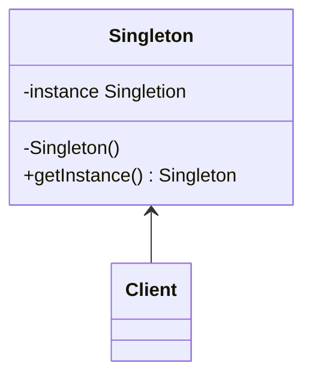

#### 5. 单利模式 *singleton*
**问题**：
	1. 保证一个类只有一个实例：控制共享资源的访问权限。
	2. 为该实例提供一个全局访问节点。
**解决方案**
  所有单例实现都包含以下两个相同的而步骤：
		- 将默认构造器私有化，防止其他对象使用单列类的new运算符
		- 新建一个静态构建方法作为构造函数。单利类会调用私有构造函数来创建对象，并将其保存在一个静态成员变量中。此后所有对于该函数的调用都将返回这一个缓存对象。
**单利模式结构**

**伪代码**
```pseudocode
class Databse is
	private static field instance:Database
	private constructor Database() is
		
	public static method getInstace() is
		if(Database.instance == null)then
			acquireThreadLock() and then 
				if(Database.instance ==null) then
					Database.instance = new Database()
		return Database.instance
	public method query(sql) is
		
class  Application is
	method main() is
		Database foo = Database.getInstance()
		foo.query("select ...")
		
		Database bar = Database.getInstance()
		bar.quiery("select")
```
**单利模式适用场景**
	- 程序中某个类对于虽有客户端只有一个可用实例。
	- 需要更加严格的控制全局变量
**实现方式**
	1. 在类中添加一个私有静态成员变量用于保存单利实例
	2. 声明一个公有静态构建方法用于获取单利实例
	3. 在静态方法中实现*延迟初始化*。该方法会在首次调用时创建一个新的对象，并将其保存在静态成员变量里。此后该方法每次被调用时都返回该实例。
	4. 将类的构造幻术设为私有。类的静态方法仍能调用构造函数，但对其他对象则不能调用。
	5. 检查客户端代码，将对单利的构造函数的调用改为对其静态构建方法的调用。
**单利模式的优缺点**
- 优点
	- 保证一个类只有一个实例
	- 能过获得一个指向该实例的全局访问节点
	- 仅在首次请求单利对象时对其进行初始化 	
- 缺点
	- 违反单一职责原则：该模式同时解决了两个问题
	- 单利模式可能掩盖不良设计，比如程序各组件之间了解过多等等
	- 在多线程环境下需要特殊处理，避免多线程多次创建单例对象
	- 单例的客户端代码单元测试可能会比较困难， 因为许多测试框架以基于继承的方式创建模拟对象。 由于单例类的构造函数是私有的， 而且绝大部分语言无法重写静态方法， 所以你需要想出仔细考虑模拟单例的方法。 要么干脆不编写测试代码， 或者不使用单例模式。