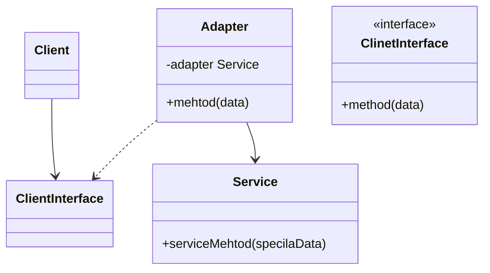
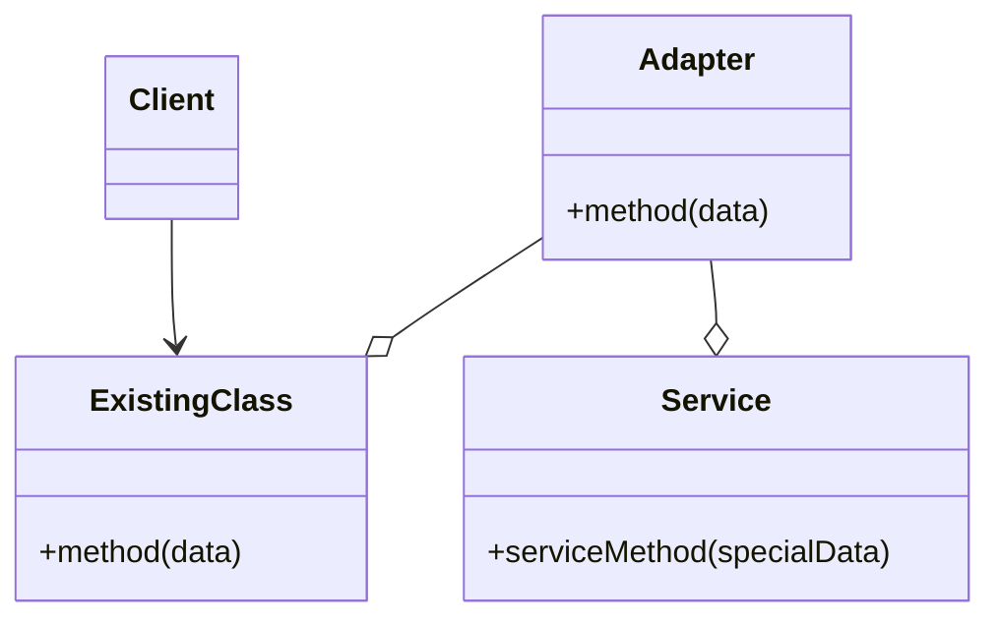
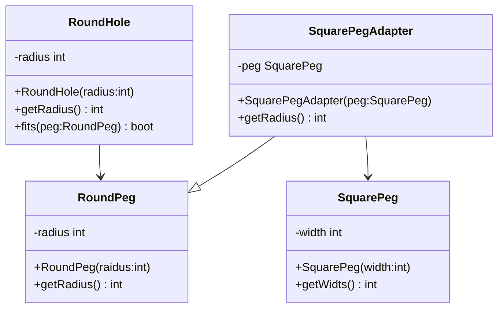

#### 2.1.适配器模式 *wrapper 、adapter*
**问题**：在一款股票市场监测程序中，它会从不同来源下载xml格式股票数据，然后向客户呈现美观的图表。在开发过程中，程序会用到一个三方分析库。但是该库只兼容json格式数据。可以通过修改程序来支持xml。但是，这可能需要修改部分依赖该库的现有代码。更糟糕的情况是你没有程序的源代码，从而无法进行修改。
**解决方案**：可以创建一个**适配器**。它是一个特殊的对象，能够转换对象接口，使其能与其他对象进行交互。适配器不仅可以转换不同格式的数据，其还有帮助与采用不同接口的对象之间的合作。它的运行方式如下：
1. 适配器实现与其中一个现有对象兼容的接口
2. 现有对象可以使用该接口安全地调用适配器
3. 适配器方法被调用后将以另一个对象兼容的格式和顺序将请求传递给该对象
**适配器模式结构**
- **对象适配器**：实现时使用了构成原则：适配器实现了其中一个对象的接口，并对另一个对象进行封装。所有流行的编程语言都可以实现适配器。

1. 客户端（client）：包含当前程序业务逻辑得类
2. 客户端接口（client interface）：描述了其他类与客户端代码合作时必须遵循的协议
3. 服务（service）:功能类（通常来自第三方或遗留系统）。客户端与其接口不兼容，因此无法直接调用其功能。
4. 适配器（adapter）：是一个可以同时与客户端和服务交互的类：它在实现客户端接口的同时封装了服务对象。适配器接受客户端通过适配器接口发起的调用，并将其转换为使用于封装服务对象的调用。
5. 客户端代码只需通过接口与适配器交互即可，无需与具体的适配器类耦合。因此，可以向程序中添加新类型的适配器而无需修改已有代码。这在服务类的接口被更改或替换时很有用：你无需修改客户端代码就可以创建新的适配器类。

**类适配器**:使用继承机制：适配器同时继承两个对象的接口。*这种方式仅能在支持多重继承的编程语言中实现*

**伪代码**

```pseudocode
class RoundHole is
	constructor RoundHole(radius){...}
	method getRadius() is
		
	method fits(peg:RoundPeg) is
		return this.getRadius()>= peg.getRadius()
class RoundPeg is
	constructor RoundPeg(radius){...}
	method getRadius() is
		
class SquarePeg is
	constructor SquarePeg(width){...}
	method getWidth() is
	
class SquarePegAdapter extends RoundPeg is
	private field peg:SquarePeg
	constructor SquarePegAdapter(peg:SquarePeg)is
		this.peg = peg
	method getRadius() is
		return peg.getWidth()*Math.sqrt(2)/2
class Client is
	method main() is
		// 客户端代码中的某个位置。
        hole = new RoundHole(5)
        rpeg = new RoundPeg(5)
        hole.fits(rpeg) // true

        small_sqpeg = new SquarePeg(5)
        large_sqpeg = new SquarePeg(10)
        hole.fits(small_sqpeg) // 此处无法编译（类型不一致）。

        small_sqpeg_adapter = new SquarePegAdapter(small_sqpeg)
        large_sqpeg_adapter = new SquarePegAdapter(large_sqpeg)
        hole.fits(small_sqpeg_adapter) // true
        hole.fits(large_sqpeg_adapter) // false
```

**适配器模式适用场景**
 - 当使用某个类，但是其接口与其他代码不兼容
 	- 适配器模式允许创建一个中间层，可作为代码与遗留类、第三方类或提供怪异接口的类之间的转换器
 - 如果需要复用一些类，他们处于同一个继承体系，并且他们又有了额外的一些共同的方法，但是这些共同的方法不是所有在这一继承体系中的子类所具有的共性
**实现方式**
1. 确保至少有两个类的接口不兼容：
   - 一个无法修改（通常是第三方、遗留系统或者存在众多已有依赖的类）的功能性服务类
   - 一个或多个将受益于使用服务类的客户端类
2. 声明客户端接口，描述客户端如何与服务交互
3. 创建遵循客户端接口的适配器类。所有方法暂时都为空
4. 在适配器类中添加一个成员变量用于保存对于服务对象的引用。通常情况下会通过构造函数对该成员变量进行初始化，但有时在调用其方法时将该变量传递给适配器会更方便。
5. 依次实现适配器类客户端接口的所有方法。适配器会将实际工作委派给服务对象，自身只负责接口或数据格式的转换。
6. 客户端必须通过客户端接口使用适配器。这样一来，就可以在不影响客户端代码的情况下修改或拓展适配器。
**适配器模式优缺点**
- 优点
	- 单一职责
	- 开闭原则
- 缺点
	- 代码整体复杂度增加