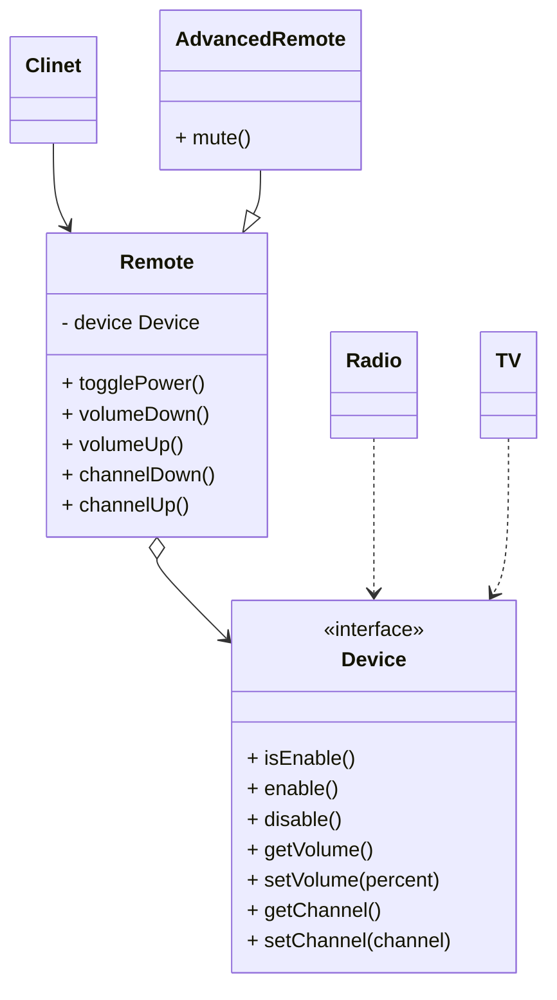

#### 2.2 桥接模式 *bridge*
**问题**：存在一个几何形状*shape*类，从它能扩展出两个子类：圆形*circle*和方形*square*。这样的层次结构又进行了拓展，他们又包含颜色。颜色类型的子类：红色*red*和蓝色*blue*。要创建已有两个子类，所以总共要创建四个类型才能覆盖所有组合，例：蓝色圆形*BuleCircle*和红色方形*RedSquare*。这样如果新增形状，子类会成几何倍数增加。
**解决方案**:问题的根本原因是我们试图在两个独立的维度“形状”和“颜色”上扩展形状类。桥接模式通过将继承改为组合的方式来解决这个问题。就是抽取其中一个维度并使之成为独立的类层次，这样就可以在初始类中引用这个新层次的对象，从而使得一个类不必拥有所有的状态和行为。根据该方法，我们可以将颜色相关的代码抽取到拥有*红色*和*蓝色*两个子类的颜色类中，然后在*形状*类中添加一个指向某一颜色对象的引用成员变量。现在，形状类可以将所有与颜色相关的工作为派给连入的颜色对象。这样的引用就成为了*形状*和*颜色*之间的桥梁。此后，新增颜色将不再需要修改形状的类层次，反之亦然。
**抽象部分和实现部分**：
	- **抽象部分**（也被称为*接口*）：是一些实体的高阶控制层。该层自身不完成任何具体的工作，它需要将工作为派给实现部分层次。
	- **实现部分**（也被称为*平台*）：
**注意：** 这里提到的内容和编程语言中的**接口**和**抽象类**无关。
在实际的程序中，抽象部分是图形用户界面（GUI），而实现部分则是狄岑操作系统跟代码（API），GUI层调用API层来对用户的各种操作做出响应。
一般来说，你可以在两个对立方向上扩展这种应用：
	- 开发多个不同的GUI（例如面向普通用户和管理员进行分别配置）
	- 支持多个不同的API（例如，能够在windows、linux和macos上运行该程序）
 桥接模式建议将类拆分成两个类层次结构：
 	- 抽象部分：程序的GUI层
 	- 实现部分：操作系统的API
 **桥接模式结构**
 ```mermaid
 classDiagram
 	Client --> Abstarction
 	RefinedAbstraction --|>Abstarction
 	Abstarction o-->Implementation
 	Concrete ..>Implementation
 	class Abstarction{
 		- i Implementation
 		+ feature1()
 		+ feature2()
 	}
 	class Implementation{
 		<<interface>>
 		+ method1()
 		+ method2()
 		+ method3()
 	}
 	class RefinedAbstraction{
 		+ featureN()
 	}
 ```
 *结构简介*：
 	1.**抽象部分**：*Abstarction*提供高层控制逻辑，依赖于完成底层结构层次实际工作的现实对象。
 	2.**实现部分**：*Implementation*为所有具体实现声明通用接口。抽象部分仅能通过在这里声明的方法与现实对象交互。
 	3.**具体实现**：*Concrete Implementations*中包括特定于平台的代码。
 	4.**精确抽象**：*Refined Abstraction*提供控制逻辑的变体。与其父类一样，他们通过通用实现接口与不同的实现进行交互。
 	5.通常情况下，**客户端** *Clinet*仅关心如何与抽象部分合作。但是，客户端需要将抽象对象与一个实现对象连接起来。
 **伪代码**：示例演示了**桥接模式**如何拆分程序中同事管理设备及其遥控器的庞杂代码。设备*Device*类作为实现部分，而遥控器*Remote*类则作为抽象部分。


```pseudocode
// “抽象部分”定义了两个类层次结构中“控制”部分的接口。它管理着一个指向“实
// 现部分”层次结构中对象的引用，并会将所有真实工作委派给该对象。
class RemoteControl is
	protected field device:Device
	constructor RemoteControl(device:Device) is
		this.device = device
	method togglePower() is
		if (device.isEnabled())then
			device.disable()
		else 
			device.enable()
	method volumeDown() is
		device.setVolume(device.getVolume()-10)
	method volumeUp() is
        device.setVolume(device.getVolume() + 10)
    method channelDown() is
        device.setChannel(device.getChannel() - 1)
    method channelUp() is
        device.setChannel(device.getChannel() + 1)
// 你可以独立于设备类的方式从抽象层中扩展类。
class AdvancedRemoteControl extends RemoteControl is
    method mute() is
        device.setVolume(0)


// “实现部分”接口声明了在所有具体实现类中通用的方法。它不需要与抽象接口相
// 匹配。实际上，这两个接口可以完全不一样。通常实现接口只提供原语操作，而
// 抽象接口则会基于这些操作定义较高层次的操作。
interface Device is
    method isEnabled()
    method enable()
    method disable()
    method getVolume()
    method setVolume(percent)
    method getChannel()
    method setChannel(channel)


// 所有设备都遵循相同的接口。
class Tv implements Device is
    // ...

class Radio implements Device is
    // ...


// 客户端代码中的某个位置。
tv = new Tv()
remote = new RemoteControl(tv)
remote.togglePower()

radio = new Radio()
remote = new AdvancedRemoteControl(radio)
```
**桥接模式适用场景**
	- 如果你想要拆分或重组一个具有多重功能的趴在类（例如能与多个数据库服务进行交互的类），可以使用桥接模式
	- 如果你希望在几个独立维度上扩展一个类，可以使用桥接模式
	- 如果你需要在运行时切换不同是按方法，可以使用桥接模式

**实现方式**：
	1. 明确类中对立的维度。独立的概念可能是：抽象/平台，域/基础设施，前端/后端 或者 接口/实现
	2. 了解客户端的业务需求，并在抽象基类中定义他们。
	3. 确定在所有平台上都可执行的业务。并在通用实现接口中声明抽象部分所需的业务。
	4. 为你域内的所有平台创建实现类，但需要确保他们遵循实现部分的接口。
	5. 在抽象类中添加执行那个实现类型的引用成员变量。抽象部分会将大部分工作委派给该成员变量指向的实现对象。
	6. 如果你的高层逻辑有多个变体，则可通过扩展抽象基类为每个变体创建一个精确抽象。
	7. 客户端代码必须将实现对象传递给抽象部分的构造函数才能使其能够相互关联。此后，客户端只需与抽象对象进行交互，无需和实现对象打交道。

**桥接模式优缺点**
	- 优点
		- 你可以创建与平台无关的类和程序
		- 客户端代码仅与高层抽象部分进行互动，不会接触到平台的详细信息
		- 开闭原则。你可以新增抽象部分和是实现部分，并且他们之间不会相互影响
		- 单一职责原则。抽象部分专注于处理高层逻辑，实现部分处理平台细节
	- 缺点
		- 对高内聚的类使用该模式可能会让代码更加复杂