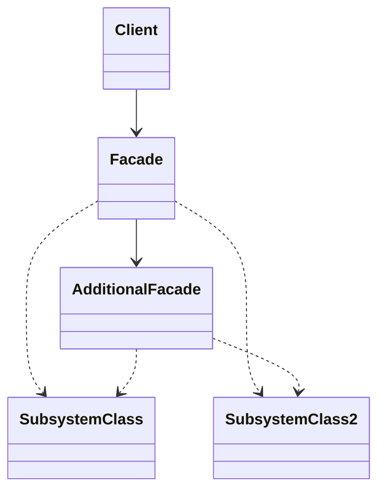
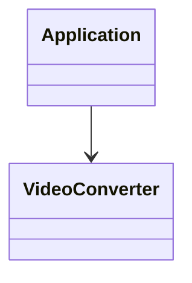

#### 2.5 外观模式 *facade*
**问题**：假设你必须在代码中使用某个复杂库或者框架中的众多对象。正常情况下，你需要负责所有对象的初始化工作、管理其依赖关系并按正确的顺序执行方法等。最终，程序中类的业务逻辑将与第三方类的实现细节紧密耦合，使得理解和维护代码的工作很难进行。
**解决方案**：外观类为包含许多活动部件的复杂子系统提供一个简单的接口。与直接调用子系统相比，外观提供的功能可能比较有限，但它却包含了客户端真正关心的功能。
**外观模式结构**

1. **外观**：*facade*提供了一种访问特定子系统功能的便捷方式，其了解如何重定向客户端请求，知晓如何操作一切活动的部件。
2. **附加外观**：*AdditionalFacade*类可以避免多种不相关的功能污染单一外观，使其变成又一个复杂结构。客户端和其他外观都可以使用附加外观。
3. **复杂子系统**：*ComplexSubsystem*由数十个不同对象构成。如果要用这些对象完成有意义的工作，你必须深入了解子系统的实现细节，比如按照正确顺序初始化对象和为其提供正确格式的数据。子系统类不会意识到外观的存在，他们在系统内运作并且相互之间可直接进行交互。
4. **客户端**：*Client*使用外观代替对子系统对象的直接调用。
**伪代码**：在本例中， 外观模式简化了客户端与复杂视频转换框架之间的交互。

```pseudocode
// 这里有复杂第三方视频转换框架中的一些类。我们不知晓其中的代码，因此无法
// 对其进行简化。

class VideoFile
// ...

class OggCompressionCodec
// ...

class MPEG4CompressionCodec
// ...

class CodecFactory
// ...

class BitrateReader
// ...

class AudioMixer
// ...


// 为了将框架的复杂性隐藏在一个简单接口背后，我们创建了一个外观类。它是在
// 功能性和简洁性之间做出的权衡。
class VideoConverter is
    method convert(filename, format):File is
        file = new VideoFile(filename)
        sourceCodec = new CodecFactory.extract(file)
        if (format == "mp4")
            destinationCodec = new MPEG4CompressionCodec()
        else
            destinationCodec = new OggCompressionCodec()
        buffer = BitrateReader.read(filename, sourceCodec)
        result = BitrateReader.convert(buffer, destinationCodec)
        result = (new AudioMixer()).fix(result)
        return new File(result)

// 应用程序的类并不依赖于复杂框架中成千上万的类。同样，如果你决定更换框架，
// 那只需重写外观类即可。
class Application is
    method main() is
        convertor = new VideoConverter()
        mp4 = convertor.convert("funny-cats-video.ogg", "mp4")
        mp4.save()
```
**外观模式适用场景**

- 如果你需要一个只想复杂子系统的直接接口，且该接口的功能有限，则可使用外观模式
	- 子系统通常会随着时间的推进变得越来越复杂。 即便是应用了设计模式， 通常你也会创建更多的类。 尽管在多种情形中子系统可能是更灵活或易于复用的， 但其所需的配置和样板代码数量将会增长得更快。 为了解决这个问题， 外观将会提供指向子系统中最常用功能的快捷方式， 能够满足客户端的大部分需求。
- 如果需要将子系统组织为多层结构，可以使用外观模式
	- 创建外观来定义子系统中各层次的入口。 你可以要求子系统仅使用外观来进行交互， 以减少子系统之间的耦合。让我们回到视频转换框架的例子。 该框架可以拆分为两个层次： 音频相关和视频相关。 你可以为每个层次创建一个外观， 然后要求各层的类必须通过这些外观进行交互。
**实现方式**
	1. 考虑能否在现有子系统的基础上提供一个更简单的接口。 如果该接口能让客户端代码独立于众多子系统类， 那么你的方向就是正确的。
	2. 在一个新的外观类中声明并实现该接口。 外观应将客户端代码的调用重定向到子系统中的相应对象处。 如果客户端代码没有对子系统进行初始化， 也没有对其后续生命周期进行管理， 那么外观必须完成此类工作。
	3. 如果要充分发挥这一模式的优势， 你必须确保所有客户端代码仅通过外观来与子系统进行交互。 此后客户端代码将不会受到任何由子系统代码修改而造成的影响， 比如子系统升级后， 你只需修改外观中的代码即可。
	4. 如果外观变得过于臃肿， 你可以考虑将其部分行为抽取为一个新的专用外观类。
**外观模式优缺点**
- 优点：可以让自己的代码独立于复杂子系统
- 缺点：外观可能成为与程序中所有类都耦合的上帝对象
