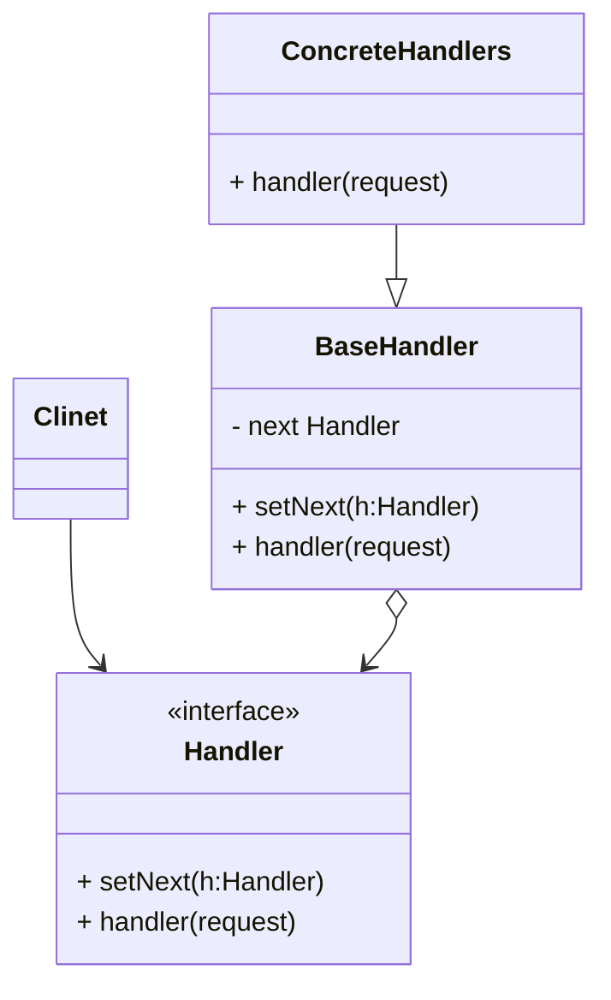
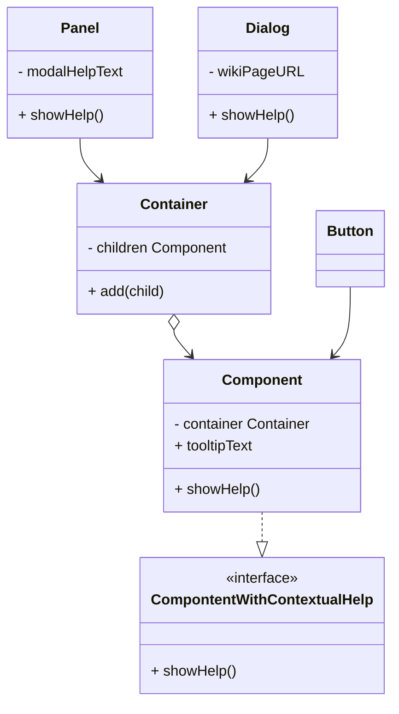

#### 3.1 责任链模式 *Cor 、Chain of Command 、Chain of Responsibility*
**问题**：假设你在开发一个在线订购系统，你希望对系统访问进行控制，只允许认证用户创建订单。此外拥有管理权限的用户也可以拥有所有订单的完全访问权限。简单规划后，你会意识到这些检查必须依次进行。只要接受到包含用户凭证的数据，应用程序就可尝试对进入系统的用户进行认证。但如果由于用户凭据不正确而导致认证失败，那就没有必要进行后续检查了。
在接下来的几个月里，你事先了后续的几个检查步骤。
	- 一位同事认为直接将原始数据传递给订单系统存在安全隐患，因此你新增了额外的验证步骤来清理请求中的数据
	- 过了一段时间，有人注意到系统无法抵御暴力密码破解方式的共计。为了防范这种情况，你立刻添加了一个检查步骤过来过滤来自同一IP地址的重复错误请求
	- 又有人提议你可以对包含同样数据的重复请求返回缓存中的结果，从而提高系统响应速度。因此，你新增了一个检查步骤，确保只有没有满足条件的缓存结果时请求才能通过并被发送给系统。
检查代码本来就已经混乱不堪，儿每次新增功能都会使其更加臃肿。 修改某个检查步骤有时会影响其他的检查步骤。 最糟糕的是， 当你希望复用这些检查步骤来保护其他系统组件时， 你只能复制部分代码， 因为这些组件只需部分而非全部的检查步骤。系统会变得让人非常费解，而且其维护成本会激增。
**解决方案**:责任链会将特定行为转换为被称作处理者的独立对象。上述示例中，没个检查步骤都可被抽取为仅有单个方法的类，并执行检查操作。请求及其数据则会被作为参数传递给该方法。**责任链模式**建议你讲这些处理者连接成一条链。链上的没个处理者都有一个成员变量来保存对于下一处理者的引用。除了处理请求外，处理者还负责沿着链传递请求。请求会在链上移动，直至所有处理者都有机会对其进行处理。最重要的是：处理者可以决定不再沿着链路传递请求，这可以高效地取消所有后续处理步骤。
**责任链模式结构**

1. **处理者**：*handler*生命力所有具体处理者的通用接口。该接口通常仅包含单个方法用于请求处理，但有时其还会包含一个设置链上下个处理者的方法。
2. **基础处理者**：*BaseHandler*是一个可选的类，你可以将所有处理者共用的样本代码放置在其中。通常情况下， 该类中定义了一个保存对于下个处理者引用的成员变量。 客户端可通过将处理者传递给上个处理者的构造函数或设定方法来创建链。 该类还可以实现默认的处理行为： 确定下个处理者存在后再将请求传递给它。
3. **具体处理者**：*ConcreteHandlers*包含处理请求的实际代码。没个处理者接收到请求后，都必须决定是否进行处理，以及是否沿着链传递请求。处理者通常是独立且不可变的，需要通过构造函数一次性低获得所有必须要的数据。
4. **客户端**：*Clint*可根据程序逻辑一次性或者动态地生成链。值得注意的是，请求可发送给链上的任意一个处理者，而非必须是第一个处理者。

**伪代码**：在本例中， 责任链模式负责为活动的 GUI 元素显示上下文帮助信息。

应用程序的 GUI　通常为对象树结构。 例如， 负责渲染程序主窗口的 对话框类就是对象树的根节点。 对话框包含 面板 ， 而面板可能包含其他面板， 或是 按钮和 文本框等下层元素。

只要给一个简单的组件指定帮助文本， 它就可显示简短的上下文提示。 但更复杂的组件可自定义上下文帮助文本的显示方式， 例如显示手册摘录内容或在浏览器中打开一个网页。
当用户将鼠标指针移动到某个元素并按下 F1键时， 程序检测到指针下的组件并对其发送帮助请求。 该请求不断向上传递到该元素所有的容器， 直至某个元素能够显示帮助信息。
```pseudocode
// 处理者接口声明了一个创建处理者链的方法。还声明了一个执行请求的方法。
interface ComponentWithContextualHelp is
    method showHelp()


// 简单组件的基础类。
abstract class Component implements ComponentWithContextualHelp is
    field tooltipText: string

    // 组件容器在处理者链中作为“下一个”链接。
    protected field container: Container

    // 如果组件设定了帮助文字，那它将会显示提示信息。如果组件没有帮助文字
    // 且其容器存在，那它会将调用传递给容器。
    method showHelp() is
        if (tooltipText != null)
            // 显示提示信息。
        else
            container.showHelp()


// 容器可以将简单组件和其他容器作为其子项目。链关系将在这里建立。该类将从
// 其父类处继承 showHelp（显示帮助）的行为。
abstract class Container extends Component is
    protected field children: array of Component

    method add(child) is
        children.add(child)
        child.container = this


// 原始组件应该能够使用帮助操作的默认实现...
class Button extends Component is
    // ...

// 但复杂组件可能会对默认实现进行重写。如果无法以新的方式来提供帮助文字，
// 那组件总是还能调用基础实现的（参见 Component 类）。
class Panel extends Container is
    field modalHelpText: string

    method showHelp() is
        if (modalHelpText != null)
            // 显示包含帮助文字的模态窗口。
        else
            super.showHelp()

// ...同上...
class Dialog extends Container is
    field wikiPageURL: string

    method showHelp() is
        if (wikiPageURL != null)
            // 打开百科帮助页面。
        else
            super.showHelp()


// 客户端代码。
class Application is
    // 每个程序都能以不同方式对链进行配置。
    method createUI() is
        dialog = new Dialog("预算报告")
        dialog.wikiPageURL = "http://..."
        panel = new Panel(0, 0, 400, 800)
        panel.modalHelpText = "本面板用于..."
        ok = new Button(250, 760, 50, 20, "确认")
        ok.tooltipText = "这是一个确认按钮..."
        cancel = new Button(320, 760, 50, 20, "取消")
        // ...
        panel.add(ok)
        panel.add(cancel)
        dialog.add(panel)

    // 想象这里会发生什么。
    method onF1KeyPress() is
        component = this.getComponentAtMouseCoords()
        component.showHelp()
```
**责任链模式适用场景**
 - 当程序需要使用不同方式处理不同类请求，而且请求类型和顺序预先未知时，可以使用责任链模式
 	- 该模式能将多个处理者连接成一条链。接收到请求后，它会“询问”没个处理者是否能够对其进行处理。这样所有处理者都有机会来处理请求。
 - 当必须按照顺序执行多个处理者时，可以使用责任链模式。
 	- 五路你以何种顺序将处理者连接成一条链，所有请求都会严格按照顺序通过链上的处理者。
 - 如果所需处理者及其熟悉怒必须在运行时进行改变，可以使用责任链模式。
 	- 如果处理者类中有对引用成员变量的设定方法，你讲能动态地插入和移除处理者，或者改变其顺序。
**实现方式**
 1. 声明处理者接口并描述请求处理方法的签名。确定客户的如何请求数据传递给方法。最灵活的方式是将请求转化为对象，然后将其以参数的形式传递给处理函数。
 2. 为了在具体处理者中消除重复的样本代码，你可以根据处理者几口创建抽象处理者基类。该类需要有一个成员变量来存储指向链上下个处理者的引用。你可以将其设置为不可变类。但如果你有打算在运行时对链进行改变，则需要定义一个设定方法来修改引用成员变量的值。为了使用方便， 你还可以实现处理方法的默认行为。 如果还有剩余对象， 该方法会将请求传递给下个对象。 具体处理者还能够通过调用父对象的方法来使用这一行为。
 3. 一次创建具体处理者子类并实现其处理方法。没个处理者在接收到请求都必须做出两个决定：
 	- 是否自动处理这个请求
 	- 是否将该请求沿着链路进行传递
 4. 客户端可以自行组装链，或者从其他对象处获得预先组装好的链。灾后一种情况下，你必须实现工厂类以根据配置或华宁设置来创建链。
 5. 客户端可以出发链中的任意处理者，而不仅仅是第一个。请求将通过链进行传递，直至某个处理者拒绝继续传递，或者请求达到链尾。
 6. 由于链的动态性，客户端需要准备好处理以下情况：
 	- 链中可能只有单个链接
 	- 部分请求可能无法达到链尾
 	- 其他请求可能直到链尾都未被处理。
**责任链模式优缺点**
 - 优点
 	- 你可以控制请求处理顺序
 	- 单一职责原则。你可以对发起操作和执行操作的类进行解耦
 	- 开闭原则。你可以在不更改现有代码的情况下在程序中新增处理者。
 - 缺点
 	- 部分请求可能未被处理 	 