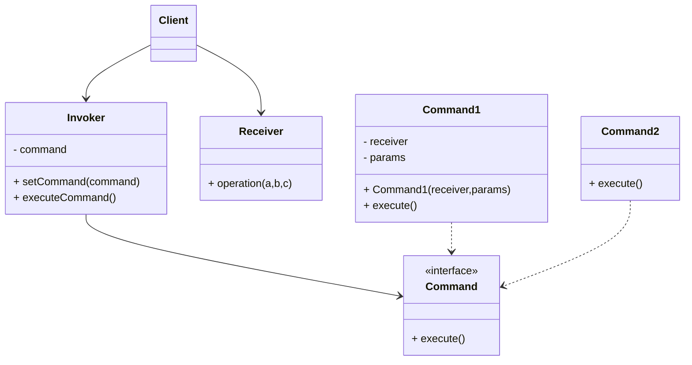
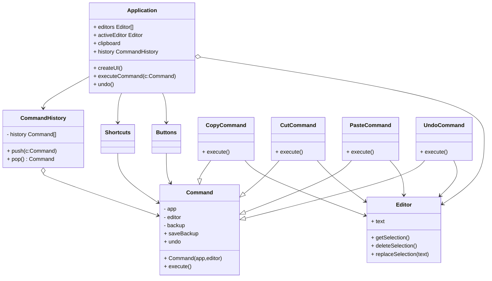

#### 3.2 命令模式 *Action、Transaction、Command*
**问题**：假如你在开发一款新的文字编辑器，当你的任务是创建一个包含多个按钮的工具栏，并让每个按钮对应编辑器的不同操作。你创建了一个非常简洁的按钮类，它不仅可用于生成工具栏上的按钮，还可用于生成各种对话框的通用按钮。尽管所有按钮看上去很相似，但他们可以完成不同的操作（打开，保存、打印和应用等）。 你会在哪里放置这些按钮的点击处理代码呢？ 最简单的解决方案是在使用按钮的每个地方都创建大量的子类。 这些子类中包含按钮点击后必须执行的代码。你很快就意识到这种方式有严重缺陷。 首先， 你创建了大量的子类， 当每次修改基类 按钮时， 你都有可能需要修改所有子类的代码。 简单来说， GUI 代码以一种拙劣的方式依赖于业务逻辑中的不稳定代码。我们的程序最初只有工具栏， 因此可以使用按钮子类来实现各种不同操作。 换句话来说， ​ 复制按钮Copy­Button子类包含复制文字的代码是可行的。 在实现了上下文菜单、 快捷方式和其他功能后， 你要么需要将操作代码复制进许多个类中， 要么需要让菜单依赖于按钮， 而后者是更糟糕的选择。
**解决方案**：优秀的软件设计通常会将关注点进行分离， 而这往往会导致软件的分层。 最常见的例子： 一层负责用户图像界面； 另一层负责业务逻辑。 GUI 层负责在屏幕上渲染美观的图形， 捕获所有输入并显示用户和程序工作的结果。 当需要完成一些重要内容时 （比如计算月球轨道或撰写年度报告）， GUI 层则会将工作委派给业务逻辑底层。

这在代码中看上去就像这样： 一个 GUI 对象传递一些参数来调用一个业务逻辑对象。 这个过程通常被描述为一个对象发送请求给另一个对象。
命令模式建议 GUI 对象不直接提交这些请求。 你应该将请求的所有细节 （例如调用的对象、 方法名称和参数列表） 抽取出来组成命令类， 该类中仅包含一个用于触发请求的方法。

命令对象负责连接不同的 GUI 和业务逻辑对象。 此后， GUI 对象无需了解业务逻辑对象是否获得了请求， 也无需了解其对请求进行处理的方式。 GUI 对象触发命令即可， 命令对象会自行处理所有细节工作。
下一步是让所有命令实现相同的接口。 该接口通常只有一个没有任何参数的执行方法， 让你能在不和具体命令类耦合的情况下使用同一请求发送者执行不同命令。 此外还有额外的好处， 现在你能在运行时切换连接至发送者的命令对象， 以此改变发送者的行为。

你可能会注意到遗漏的一块拼图——请求的参数。 GUI 对象可以给业务层对象提供一些参数。 但执行命令方法没有任何参数， 所以我们如何将请求的详情发送给接收者呢？ 答案是： 使用数据对命令进行预先配置， 或者让其能够自行获取数据。让我们回到文本编辑器。 应用命令模式后， 我们不再需要任何按钮子类来实现点击行为。 我们只需在 按钮Button基类中添加一个成员变量来存储对于命令对象的引用， 并在点击后执行该命令即可。

你需要为每个可能的操作实现一系列命令类， 并且根据按钮所需行为将命令和按钮连接起来。

其他菜单、 快捷方式或整个对话框等 GUI 元素都可以通过相同方式来实现。 当用户与 GUI 元素交互时， 与其连接的命令将会被执行。 现在你很可能已经猜到了， 与相同操作相关的元素将会被连接到相同的命令， 从而避免了重复代码。

最后， 命令成为了减少 GUI 和业务逻辑层之间耦合的中间层。 而这仅仅是命令模式所提供的一小部分好处！
**命令模式结构**

1. **发送者**：*Sender*亦称为“触发者”*Invoker* 类负责对请求进行初始化，其中必须包含一个成员变量来存储对于命令对象的引用。发送者触发命令，而不向接受者直接发送请求。注意，发送者并不负责创建命令对象：它通常会通过构造函数从客户端处获得预先生成的命令。
2. **命令**：*Command*接口通常仅声明一个执行命令的方法。
3. **具体命令**：*ConcreteCommands*会实现各种类型的请求。具体命令自身并不完成工作，而是会将调用委派给一个业务逻辑对象。但为了简化，这些类可以进行合并。接收对象执行方法所需的参数可以声明为具体命令的成员变量。 你可以将命令对象设为不可变， 仅允许通过构造函数对这些成员变量进行初始化。
4. **接收者**：*Receiver*类包含部分业务逻辑。几乎任何对象都可以作为接收者。绝大部分命令只处理如何将请求传递到接收者的细节，接收者自己会完成实际的工作。
5. **客户端**：*Client*会创建并配置具体命令对象。客户端必须将包含接收者实体在内的所有请求参数传递给命令的构造函数。此后生成的命令就可以与一个或多个发送者相关联。
**伪代码**：在本例中， 命令模式会记录已执行操作的历史记录， 以在需要时撤销操作。

有些命令会改变编辑器的状态 （例如剪切和粘贴）， 它们可在执行相关操作前对编辑器的状态进行备份。 命令执行后会和当前点备份的编辑器状态一起被放入命令历史 （命令对象栈）。 此后， 如果用户需要进行回滚操作， 程序可从历史记录中取出最近的命令， 读取相应的编辑器状态备份， 然后进行恢复。

客户端代码 （GUI 元素和命令历史等） 没有和具体命令类相耦合， 因为它通过命令接口来使用命令。 这使得你能在无需修改已有代码的情况下在程序中增加新的命令。
```pseudocode
// 命令基类会为所有具体命令定义通用接口。
abstract class Command is
    protected field app: Application
    protected field editor: Editor
    protected field backup: text

    constructor Command(app: Application, editor: Editor) is
        this.app = app
        this.editor = editor

    // 备份编辑器状态。
    method saveBackup() is
        backup = editor.text

    // 恢复编辑器状态。
    method undo() is
        editor.text = backup

    // 执行方法被声明为抽象以强制所有具体命令提供自己的实现。该方法必须根
    // 据命令是否更改编辑器的状态返回 true 或 false。
    abstract method execute()


// 这里是具体命令。
class CopyCommand extends Command is
    // 复制命令不会被保存到历史记录中，因为它没有改变编辑器的状态。
    method execute() is
        app.clipboard = editor.getSelection()
        return false

class CutCommand extends Command is
    // 剪切命令改变了编辑器的状态，因此它必须被保存到历史记录中。只要方法
    // 返回 true，它就会被保存。
    method execute() is
        saveBackup()
        app.clipboard = editor.getSelection()
        editor.deleteSelection()
        return true

class PasteCommand extends Command is
    method execute() is
        saveBackup()
        editor.replaceSelection(app.clipboard)
        return true

// 撤销操作也是一个命令。
class UndoCommand extends Command is
    method execute() is
        app.undo()
        return false


// 全局命令历史记录就是一个堆桟。
class CommandHistory is
    private field history: array of Command

    // 后进...
    method push(c: Command) is
        // 将命令压入历史记录数组的末尾。

    // ...先出
    method pop():Command is
        // 从历史记录中取出最近的命令。


// 编辑器类包含实际的文本编辑操作。它会担任接收者的角色：最后所有命令都会
// 将执行工作委派给编辑器的方法。
class Editor is
    field text: string

    method getSelection() is
        // 返回选中的文字。

    method deleteSelection() is
        // 删除选中的文字。

    method replaceSelection(text) is
        // 在当前位置插入剪贴板中的内容。

// 应用程序类会设置对象之间的关系。它会担任发送者的角色：当需要完成某些工
// 作时，它会创建并执行一个命令对象。
class Application is
    field clipboard: string
    field editors: array of Editors
    field activeEditor: Editor
    field history: CommandHistory

    // 将命令分派给 UI 对象的代码可能会是这样的。
    method createUI() is
        // ...
        copy = function() { executeCommand(
            new CopyCommand(this, activeEditor)) }
        copyButton.setCommand(copy)
        shortcuts.onKeyPress("Ctrl+C", copy)

        cut = function() { executeCommand(
            new CutCommand(this, activeEditor)) }
        cutButton.setCommand(cut)
        shortcuts.onKeyPress("Ctrl+X", cut)

        paste = function() { executeCommand(
            new PasteCommand(this, activeEditor)) }
        pasteButton.setCommand(paste)
        shortcuts.onKeyPress("Ctrl+V", paste)

        undo = function() { executeCommand(
            new UndoCommand(this, activeEditor)) }
        undoButton.setCommand(undo)
        shortcuts.onKeyPress("Ctrl+Z", undo)

    // 执行一个命令并检查它是否需要被添加到历史记录中。
    method executeCommand(command) is
        if (command.execute)
            history.push(command)

    // 从历史记录中取出最近的命令并运行其 undo（撤销）方法。请注意，你并
    // 不知晓该命令所属的类。但是我们不需要知晓，因为命令自己知道如何撤销
    // 其动作。
    method undo() is
        command = history.pop()
        if (command != null)
            command.undo()
```
**命令模式适用场景**
- 如果你需要通过操作来参数化对象，可用命令模式
	- 命令模式可将特定的方法调用转化为独立对象。这一改变带来许多有趣的应用：你可将命令作为方法的参数进行传递、将命令保存在其他对象中，或者在运行时切换已连接的命令。
- 如果你想将操作放入队列中、操作的执行或者远程执行操作，可使用命令模式。 	 
	- 同其他对象一样， 命令也可以实现序列化 （序列化的意思是转化为字符串）， 从而能方便地写入文件或数据库中。 一段时间后， 该字符串可被恢复成为最初的命令对象。 因此， 你可以延迟或计划命令的执行。 但其功能远不止如此！ 使用同样的方式， 你还可以将命令放入队列、 记录命令或者通过网络发送命令。
- 如果你想要实现操作回滚功能，可使用命令模式。
	-  尽管有很多方法可以实现撤销和恢复功能， 但命令模式可能是其中最常用的一种。为了能够回滚操作， 你需要实现已执行操作的历史记录功能。 命令历史记录是一种包含所有已执行命令对象及其相关程序状态备份的栈结构。这种方法有两个缺点。 首先， 程序状态的保存功能并不容易实现， 因为部分状态可能是私有的。 你可以使用备忘录模式来在一定程度上解决这个问题。其次， 备份状态可能会占用大量内存。 因此， 有时你需要借助另一种实现方式： 命令无需恢复原始状态， 而是执行反向操作。 反向操作也有代价： 它可能会很难甚至是无法实现。
**实现方式**
1. 声明仅有一个执行方法的命令接口
2. 抽取请求并使之成为实现命令接口的具体命令类。每个类都必须有一组成员变量来保存请求参数和对于世界接收者对象的引用。所有这些变量的数值都必须通过命令构造函数进行初始化。
3. 找到担任**发送者**职责的类。在这些类中添加保存命令的成员变量。发送者只能通过接口语气命令进行交互。发送者自身通常并不创建命令对象，而是通过客户端代码获取。
4. 修改发送者使其执行命令，而非直接将请求发送给接收者。
5. 客户端必须按照以下顺序来初始化对象：
	- 创建接收者
	- 创建命令，如有需要可将其关联至接收者
	- 创建发送者并将其与特定命令关联
**命令模式优缺点**
- 优点
	- 单一职责原则
	- 开闭原则
	- 可以实现撤销和恢复功能
	- 可以实现操作延迟执行
	- 可以将一组简单命令组合成一个复杂命令
- 缺点
	- 代码可能变得更加复杂。 因为在发送者和接收者之间增加了一个全新的层次。  . 