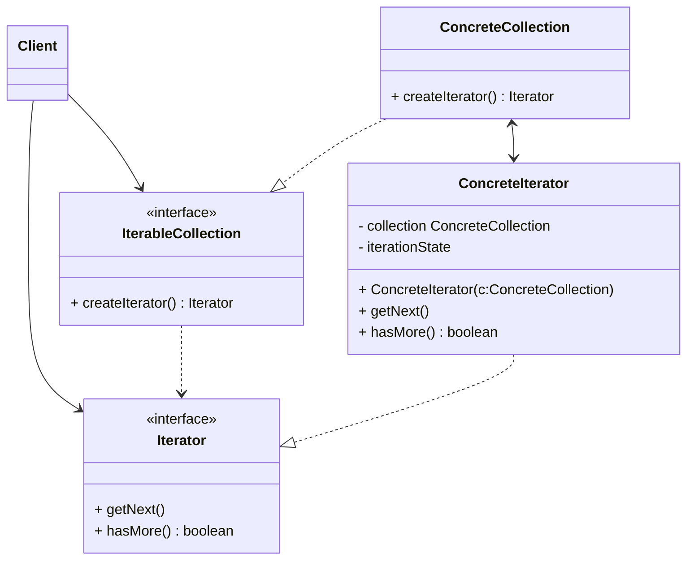
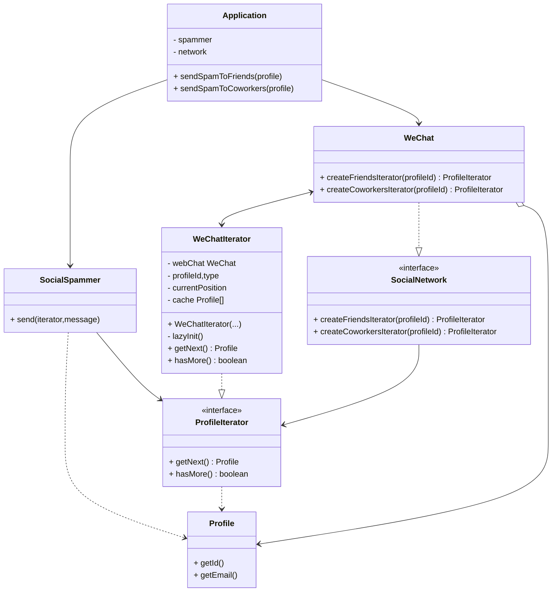

#### 3.3 迭代器模式 *iterator*
**问题**:集合是编程中最常使用的数据类型之一。 尽管如此， 集合只是一组对象的容器而已。大部分集合使用简单列表存储元素。 但有些集合还会使用栈、 树、 图和其他复杂的数据结构。

无论集合的构成方式如何， 它都必须提供某种访问元素的方式， 便于其他代码使用其中的元素。 集合应提供一种能够遍历元素的方式， 且保证它不会周而复始地访问同一个元素。

如果你的集合基于列表， 那么这项工作听上去仿佛很简单。 但如何遍历复杂数据结构 （例如树） 中的元素呢？ 例如， 今天你需要使用深度优先算法来遍历树结构， 明天可能会需要广度优先算法； 下周则可能会需要其他方式 （比如随机存取树中的元素）。
不断向集合中添加遍历算法会模糊其 “高效存储数据” 的主要职责。 此外， 有些算法可能是根据特定应用订制的， 将其加入泛型集合类中会显得非常奇怪。

另一方面， 使用多种集合的客户端代码可能并不关心存储数据的方式。 不过由于集合提供不同的元素访问方式， 你的代码将不得不与特定集合类进行耦合。
**解决方案**:迭代器模式的主要思想是将集合的遍历行为抽取为单独的**迭代器**对象。
除实现自身算法外， 迭代器还封装了遍历操作的所有细节， 例如当前位置和末尾剩余元素的数量。 因此， 多个迭代器可以在相互独立的情况下同时访问集合。

迭代器通常会提供一个获取集合元素的基本方法。 客户端可不断调用该方法直至它不返回任何内容， 这意味着迭代器已经遍历了所有元素。

所有迭代器必须实现相同的接口。 这样一来， 只要有合适的迭代器， 客户端代码就能兼容任何类型的集合或遍历算法。 如果你需要采用特殊方式来遍历集合， 只需创建一个新的迭代器类即可， 无需对集合或客户端进行修改。
**迭代器模式结构**：

1. **迭代器**：*iterator*接口生命力遍历结合所需的操作：
	- 获取下一个元素
	- 获取当前位置
	- 重新开始迭代
2. **具体迭代器**：*ConcreteIterator*实现遍历集合的一种特定算法。迭代器对象必须跟踪自身遍历的进度。这使得多个迭代器可以相互独立地遍历同一集合
3. **集合**：*collection*接口声明一个或多个方法来获取与集合兼容的迭代器。请注意，返回方法的类型必须被声明为迭代器接口，因此具体集合可以返回各种不同类型的迭代器。
4. **具体集合**：*concrete collection*会在客户端请求迭代器时返回一个特定的具体迭代器类实体。
5. **客户端**：*client*通过集合和迭代器的接口与量着进行交互。这样一来客户端唔需与具体类进行耦合， 允许同一客户端代码使用各种不同的集合和迭代器。客户端通常不会自行创建迭代器， 而是会从集合中获取。 但在特定情况下， 客户端可以直接创建一个迭代器 （例如当客户端需要自定义特殊迭代器时）。
**伪代码**在本例中， 迭代器模式用于遍历一个封装了访问微信好友关系功能的特殊集合。 该集合提供使用不同方式遍历档案资料的多个迭代器。

“好友 （friends）” 迭代器可用于遍历指定档案的好友。 ​ “同事 （colleagues）” 迭代器也提供同样的功能， 但仅包括与目标用户在同一家公司工作的好友。 这两个迭代器都实现了同一个通用接口， 客户端能在不了解认证和发送 REST 请求等实现细节的情况下获取档案。
客户端仅通过接口与集合和迭代器交互， 也就不会同具体类耦合。 如果你决定将应用连接到全新的社交网络， 只需提供新的集合和迭代器类即可， 无需修改现有代码。
```pseudocode
// 集合接口必须声明一个用于生成迭代器的工厂方法。如果程序中有不同类型的迭
// 代器，你也可以声明多个方法。
interface SocialNetwork is
    method createFriendsIterator(profileId):ProfileIterator
    method createCoworkersIterator(profileId):ProfileIterator


// 每个具体集合都与其返回的一组具体迭代器相耦合。但客户并不是这样的，因为
// 这些方法的签名将会返回迭代器接口。
class WeChat implements SocialNetwork is
    // ...大量的集合代码应该放在这里...

    // 迭代器创建代码。
    method createFriendsIterator(profileId) is
        return new WeChatIterator(this, profileId, "friends")
    method createCoworkersIterator(profileId) is
        return new WeChatIterator(this, profileId, "coworkers")


// 所有迭代器的通用接口。
interface ProfileIterator is
    method getNext():Profile
    method hasMore():bool


// 具体迭代器类。
class WeChatIterator implements ProfileIterator is
    // 迭代器需要一个指向其遍历集合的引用。
    private field weChat: WeChat
    private field profileId, type: string

    // 迭代器对象会独立于其他迭代器来对集合进行遍历。因此它必须保存迭代器
    // 的状态。
    private field currentPosition
    private field cache: array of Profile

    constructor WeChatIterator(weChat, profileId, type) is
        this.weChat = weChat
        this.profileId = profileId
        this.type = type

    private method lazyInit() is
        if (cache == null)
            cache = weChat.socialGraphRequest(profileId, type)

    // 每个具体迭代器类都会自行实现通用迭代器接口。
    method getNext() is
        if (hasMore())
            currentPosition++
            return cache[currentPosition]

    method hasMore() is
        lazyInit()
        return currentPosition < cache.length


// 这里还有一个有用的绝招：你可将迭代器传递给客户端类，无需让其拥有访问整
// 个集合的权限。这样一来，你就无需将集合暴露给客户端了。
//
// 还有另一个好处：你可在运行时将不同的迭代器传递给客户端，从而改变客户端
// 与集合互动的方式。这一方法可行的原因是客户端代码并没有和具体迭代器类相
// 耦合。
class SocialSpammer is
    method send(iterator: ProfileIterator, message: string) is
        while (iterator.hasMore())
            profile = iterator.getNext()
            System.sendEmail(profile.getEmail(), message)


// 应用程序（Application）类可对集合和迭代器进行配置，然后将其传递给客户
// 端代码。
class Application is
    field network: SocialNetwork
    field spammer: SocialSpammer

    method config() is
        if working with WeChat
            this.network = new WeChat()
        if working with LinkedIn
            this.network = new LinkedIn()
        this.spammer = new SocialSpammer()

    method sendSpamToFriends(profile) is
        iterator = network.createFriendsIterator(profile.getId())
        spammer.send(iterator, "非常重要的消息")

    method sendSpamToCoworkers(profile) is
        iterator = network.createCoworkersIterator(profile.getId())
        spammer.send(iterator, "非常重要的消息")
```
**迭代器模式适用场景**
- 当结合背后为复杂的数据结构，且你希望对客户端隐藏其复杂性时（出于使用便利性或安全性的考虑），可以使用迭代器模式
	- 迭代器封装了与复杂数据结构进行交互的细节， 为客户端提供多个访问集合元素的简单方法。 这种方式不仅对客户端来说非常方便， 而且能避免客户端在直接与集合交互时执行错误或有害的操作， 从而起到保护集合的作用。
- 使用该模式可以减少程序中重复的遍历代码 
	- 重要迭代算法的代码往往体积非常庞大。 当这些代码被放置在程序业务逻辑中时， 它会让原始代码的职责模糊不清， 降低其可维护性。 因此， 将遍历代码移到特定的迭代器中可使程序代码更加精炼和简洁。
- 如果你希望代码能够遍历不同的甚至是无法预知的数据结构，可以使用迭代器模式
	- 该模式为集合和迭代器提供了一些通用接口。 如果你在代码中使用了这些接口， 那么将其他实现了这些接口的集合和迭代器传递给它时， 它仍将可以正常运行。
**实现方式**
1. 声明迭代器接口。该接口必须提供至少一个方法来获取集合中的下个元素。但为了使用方便，你还可以添加一些其他方法，例如获取前一个元素、记录当前位置和判读迭代是否已结束。
2. 声明集合接口并描述一个获取迭代器的方法。其返回值必须是迭代器接口。如果你几乎拥有多组不同的迭代器，则可以声明多个类似的方法。
3. 为希望使用迭代器进行遍历的集合实现具体迭代器类。迭代器对象必须与单个集合实体链接。链接关系通常通过迭代器的构造函数建立。
4. 在你的集合类中实现集合接口。 其主要思想是针对特定集合为客户端代码提供创建迭代器的快捷方式。 集合对象必须将自身传递给迭代器的构造函数来创建两者之间的链接。
5. 检查客户端代码， 使用迭代器替代所有集合遍历代码。 每当客户端需要遍历集合元素时都会获取一个新的迭代器。
**迭代器模式优缺点**
- 优点
	 - 单一职责
	 - 开闭原则
	 - 你可以并行遍历同一集合， 因为每个迭代器对象都包含其自身的遍历状态。
	 - 相似的， 你可以暂停遍历并在需要时继续。
- 缺点 
	-  如果你的程序只与简单的集合进行交互， 应用该模式可能会矫枉过正。
	-  对于某些特殊集合， 使用迭代器可能比直接遍历的效率低。
