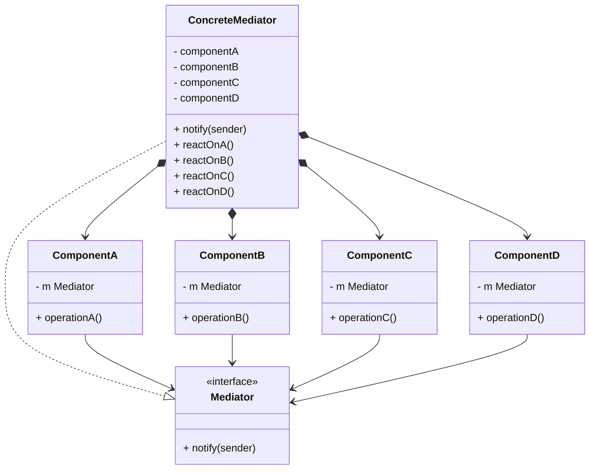
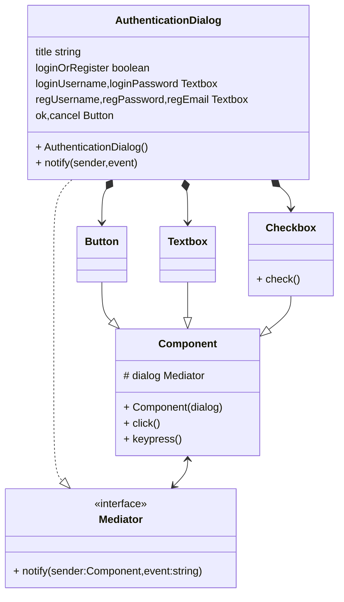

#### 3.4 中介者模式 *intermediary、controller、mediator*
**问题**：假如你有一个创建和修改客户资料的对话框， 它由各种控件组成， 例如文本框 （Text­Field）、 复选框 （Checkbox） 和按钮 （Button） 等。
某些表单元素可能会直接进行互动。 例如， 选中 “我有一只狗” 复选框后可能会显示一个隐藏文本框用于输入狗狗的名字。 另一个例子是提交按钮必须在保存数据前校验所有输入内容。
如果直接在表单元素代码中实现业务逻辑， 你将很难在程序其他表单中复用这些元素类。 例如， 由于复选框类与狗狗的文本框相耦合， 所以将无法在其他表单中使用它。 你要么使用渲染资料表单时用到的所有类， 要么一个都不用。
**解决方案**:中介者模式建议你停止组件之间的直接交流并使其相互独立。 这些组件必须调用特殊的中介者对象， 通过中介者对象重定向调用行为， 以间接的方式进行合作。 最终， 组件仅依赖于一个中介者类， 无需与多个其他组件相耦合。

在资料编辑表单的例子中， 对话框 （Dialog） 类本身将作为中介者， 其很可能已知自己所有的子元素， 因此你甚至无需在该类中引入新的依赖关系。
绝大部分重要的修改都在实际表单元素中进行。 让我们想想提交按钮。 之前， 当用户点击按钮后， 它必须对所有表单元素数值进行校验。 而现在它的唯一工作是将点击事件通知给对话框。 收到通知后， 对话框可以自行校验数值或将任务委派给各元素。 这样一来， 按钮不再与多个表单元素相关联， 而仅依赖于对话框类。

你还可以为所有类型的对话框抽取通用接口， 进一步削弱其依赖性。 接口中将声明一个所有表单元素都能使用的通知方法， 可用于将元素中发生的事件通知给对话框。 这样一来， 所有实现了该接口的对话框都能使用这个提交按钮了。

采用这种方式， 中介者模式让你能在单个中介者对象中封装多个对象间的复杂关系网。 类所拥有的依赖关系越少， 就越易于修改、 扩展或复用。
**中介者模式结构**

1. **组件**：*component*是各种包含业务逻辑的类。没个组件都有一个指向中介者的引用，该引用被声明为中介者接口类型。组件不知道中介者实际所需的类，因此你可通过将其连接到不同的中介者以使用其能在其他程序中复用。
2. **中介者**：*mediator*接口声明了与组件交流的方法，但通常仅包括一个通知方法。 组件可将任意上下文 （包括自己的对象） 作为该方法的参数， 只有这样接收组件和发送者类之间才不会耦合。
3. **具体中介者**：*concrete mediator*丰庄路多种组件间的关系。具体中介者通常会爆粗你所有组件的引用并对其进行管理，甚至有时会对其生命周期进行管理。
4. 组件并不知道其他组件的情况。 如果组件内发生了重要事件， 它只能通知中介者。 中介者收到通知后能轻易地确定发送者， 这或许已足以判断接下来需要触发的组件了。
**伪代码**
在本例中， 中介者模式可帮助你减少各种 UI 类 （按钮、 复选框和文本标签） 之间的相互依赖关系。

用户触发的元素不会直接与其他元素交流， 即使看上去它们应该这样做。 相反， 元素只需让中介者知晓事件即可， 并能在发出通知时同时传递任何上下文信息。

本例中的中介者是整个认证对话框。 对话框知道具体元素应如何进行合作并促进它们的间接交流。 当接收到事件通知后， 对话框会确定负责处理事件的元素并据此重定向请求。
```pseudocode
// 中介者接口声明了一个能让组件将各种事件通知给中介者的方法。中介者可对这
// 些事件做出响应并将执行工作传递给其他组件。
interface Mediator is
    method notify(sender: Component, event: string)


// 具体中介者类可解开各组件之间相互交叉的连接关系并将其转移到中介者中。
class AuthenticationDialog implements Mediator is
    private field title: string
    private field loginOrRegisterChkBx: Checkbox
    private field loginUsername, loginPassword: Textbox
    private field registrationUsername, registrationPassword,
                  registrationEmail: Textbox
    private field okBtn, cancelBtn: Button

    constructor AuthenticationDialog() is
        // 创建所有组件对象并将当前中介者传递给其构造函数以建立连接。

    // 当组件中有事件发生时，它会通知中介者。中介者接收到通知后可自行处理，
    // 也可将请求传递给另一个组件。
    method notify(sender, event) is
        if (sender == loginOrRegisterChkBx and event == "check")
            if (loginOrRegisterChkBx.checked)
                title = "登录"
                // 1. 显示登录表单组件。
                // 2. 隐藏注册表单组件。
            else
                title = "注册"
                // 1. 显示注册表单组件。
                // 2. 隐藏登录表单组件。

        if (sender == okBtn && event == "click")
            if (loginOrRegister.checked)
                // 尝试找到使用登录信息的用户。
                if (!found)
                    // 在登录字段上方显示错误信息。
            else
                // 1. 使用注册字段中的数据创建用户账号。
                // 2. 完成用户登录工作。 …


// 组件会使用中介者接口与中介者进行交互。因此只需将它们与不同的中介者连接
// 起来，你就能在其他情境中使用这些组件了。
class Component is
    field dialog: Mediator

    constructor Component(dialog) is
        this.dialog = dialog

    method click() is
        dialog.notify(this, "click")

    method keypress() is
        dialog.notify(this, "keypress")

// 具体组件之间无法进行交流。它们只有一个交流渠道，那就是向中介者发送通知。
class Button extends Component is
    // ...

class Textbox extends Component is
    // ...

class Checkbox extends Component is
    method check() is
        dialog.notify(this, "check")
    // ...
```
**中介者模式适用场景**
- 当一些对象和其他对象紧密耦合以致难以对其进行修改时， 可使用中介者模式。
 	- 该模式让你将对象间的所有关系抽取成为一个单独的类， 以使对于特定组件的修改工作独立于其他组件。
-   当组件因过于依赖其他组件而无法在不同应用中复用时， 可使用中介者模式
	-  应用中介者模式后， 每个组件不再知晓其他组件的情况。 尽管这些组件无法直接交流， 但它们仍可通过中介者对象进行间接交流。 如果你希望在不同应用中复用一个组件， 则需要为其提供一个新的中介者类。
-  如果为了能在不同情景下复用一些基本行为， 导致你需要被迫创建大量组件子类时， 可使用中介者模式。
	-   由于所有组件间关系都被包含在中介者中， 因此你无需修改组件就能方便地新建中介者类以定义新的组件合作方式。
**实现方式**
1. 找到一组当前紧密耦合， 且提供其独立性能带来更大好处的类 （例如更易于维护或更方便复用）。
2. 声明中介者接口并描述中介者和各种组件之间所需的交流接口。 在绝大多数情况下， 一个接收组件通知的方法就足够了。 如果你希望在不同情景下复用组件类， 那么该接口将非常重要。 只要组件使用通用接口与其中介者合作， 你就能将该组件与不同实现中的中介者进行连接。
3. 实现具体中介者类。 该类可从自行保存其下所有组件的引用中受益。
4. 你可以更进一步， 让中介者负责组件对象的创建和销毁。 此后， 中介者可能会与工厂或外观类似。
5. 组件必须保存对于中介者对象的引用。 该连接通常在组件的构造函数中建立， 该函数会将中介者对象作为参数传递。
6. 修改组件代码， 使其可调用中介者的通知方法， 而非其他组件的方法。 然后将调用其他组件的代码抽取到中介者类中， 并在中介者接收到该组件通知时执行这些代码。