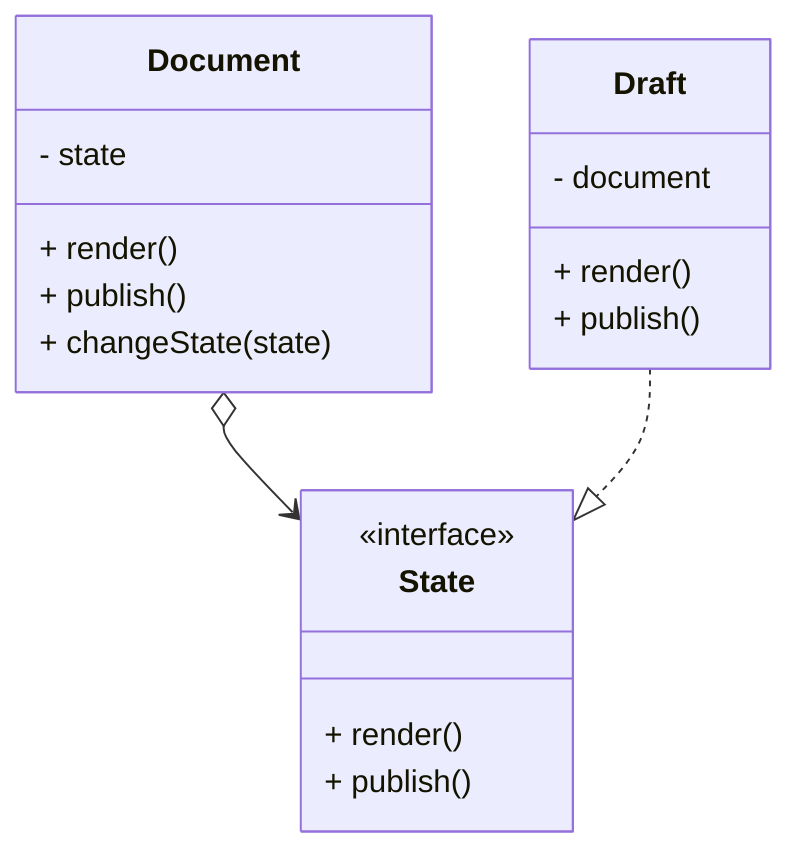
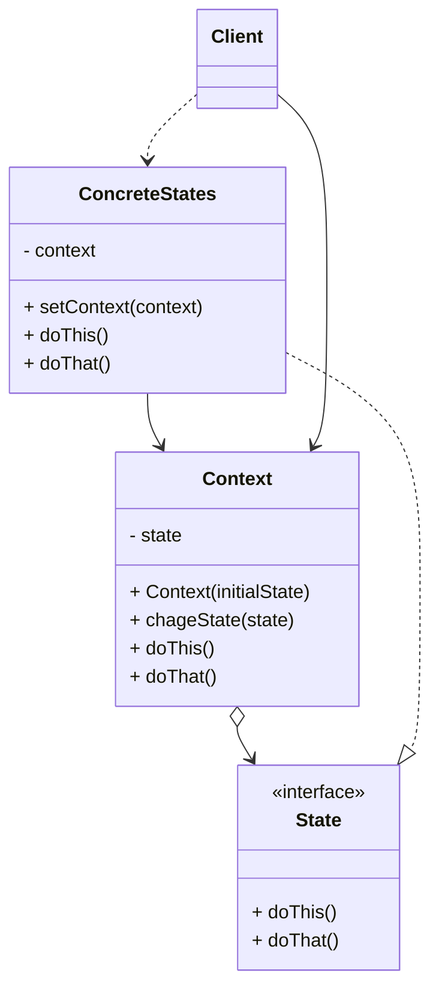
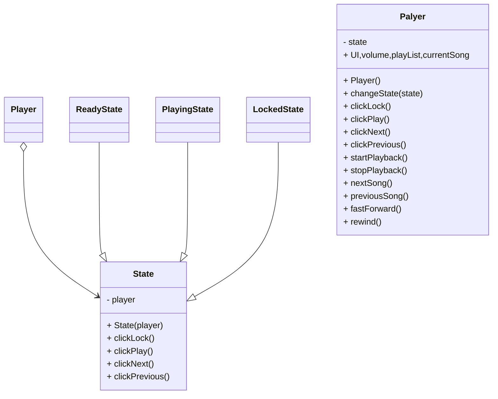

#### 3.7 状态模式 *state*
**问题**：状态模式与有限状态机的概念紧密相关。其主要思想是程序在任意时刻仅可处于几种有限的状态中。 在任何一个特定状态中， 程序的行为都不相同， 且可瞬间从一个状态切换到另一个状态。 不过， 根据当前状态， 程序可能会切换到另外一种状态， 也可能会保持当前状态不变。 这些数量有限且预先定义的状态切换规则被称为转移。
你还可将该方法应用在对象上。 假如你有一个 文档Document类。 文档可能会处于 草稿Draft 、 ​ 审阅中Moderation和 已发布Published三种状态中的一种。 文档的 publish发布方法在不同状态下的行为略有不同：
- 处于 草稿状态时， 它会将文档转移到审阅中状态。
- 处于 审阅中状态时， 如果当前用户是管理员， 它会公开发布文档。
- 处于 已发布状态时， 它不会进行任何操作。
状态机通常由众多条件运算符 （ if或 switch ） 实现， 可根据对象的当前状态选择相应的行为。 ​ “状态” 通常只是对象中的一组成员变量值。 即使你之前从未听说过有限状态机， 你也很可能已经实现过状态模式。 下面的代码应该能帮助你回忆起来。
```pseudocode
class Document is
    field state: string
    // ...
    method publish() is
        switch (state)
            "draft":
                state = "moderation"
                break
            "moderation":
                if (currentUser.role == 'admin')
                    state = "published"
                break
            "published":
                // 什么也不做。
                break
```
当我们逐步在 文档类中添加更多状态和依赖于状态的行为后， 基于条件语句的状态机就会暴露其最大的弱点。 为了能根据当前状态选择完成相应行为的方法， 绝大部分方法中会包含复杂的条件语句。 修改其转换逻辑可能会涉及到修改所有方法中的状态条件语句， 导致代码的维护工作非常艰难。

这个问题会随着项目进行变得越发严重。 我们很难在设计阶段预测到所有可能的状态和转换。 随着时间推移， 最初仅包含有限条件语句的简洁状态机可能会变成臃肿的一团乱麻。
**解决方案**：状态模式建议为对象的所有可能状态新建一个类， 然后将所有状态的对应行为抽取到这些类中。

原始对象被称为上下文 （context）， 它并不会自行实现所有行为， 而是会保存一个指向表示当前状态的状态对象的引用， 且将所有与状态相关的工作委派给该对象。

如需将上下文转换为另外一种状态， 则需将当前活动的状态对象替换为另外一个代表新状态的对象。 采用这种方式是有前提的： 所有状态类都必须遵循同样的接口， 而且上下文必须仅通过接口与这些对象进行交互。

这个结构可能看上去与策略模式相似， 但有一个关键性的不同——在状态模式中， 特定状态知道其他所有状态的存在， 且能触发从一个状态到另一个状态的转换； 策略则几乎完全不知道其他策略的存在。
**状态模式结构**

1. **上下文**：*context*保存了对于一个具体状态对象的引用，炳辉将所有与该状态相关的工作委派给它。上下文通过状态接口与状态对象交互，且会提供一个设置器用于传递新的状态对象。
2. **状态**：*state*接口会声明特定于状态的方法。这些方法应能够被其他所有具体状态所理解，因为你不希望某些状态所拥有的方法永远你不会被调用。
3. **具体状态**：*concrete states*会自行实现特定于状态的方法。为了避免多个状态中包含相似代码。你可以提供一个封装部分通用行为的中间抽象类。状态对象可存储对于上下文对象的反向引用。 状态可以通过该引用从上下文处获取所需信息， 并且能触发状态转移。
4. 上下文和具体状态都可以设置上下文的下个状态， 并可通过替换连接到上下文的状态对象来完成实际的状态转换。
**伪代码**
在本例中， 状态模式将根据当前回放状态， 让媒体播放器中的相同控件完成不同的行为。

播放器的主要对象总是会连接到一个负责播放器绝大部分工作的状态对象中。 部分操作会更换播放器当前的状态对象， 以此改变播放器对于用户互动所作出的反应。
```pseudocode
// 音频播放器（Audio­Player）类即为上下文。它还会维护指向状态类实例的引用，
// 该状态类则用于表示音频播放器当前的状态。
class AudioPlayer is
    field state: State
    field UI, volume, playlist, currentSong

    constructor AudioPlayer() is
        this.state = new ReadyState(this)

        // 上下文会将处理用户输入的工作委派给状态对象。由于每个状态都以不
        // 同的方式处理输入，其结果自然将依赖于当前所处的状态。
        UI = new UserInterface()
        UI.lockButton.onClick(this.clickLock)
        UI.playButton.onClick(this.clickPlay)
        UI.nextButton.onClick(this.clickNext)
        UI.prevButton.onClick(this.clickPrevious)

    // 其他对象必须能切换音频播放器当前所处的状态。
    method changeState(state: State) is
        this.state = state

    // UI 方法会将执行工作委派给当前状态。
    method clickLock() is
        state.clickLock()
    method clickPlay() is
        state.clickPlay()
    method clickNext() is
        state.clickNext()
    method clickPrevious() is
        state.clickPrevious()

    // 状态可调用上下文的一些服务方法。
    method startPlayback() is
        // ...
    method stopPlayback() is
        // ...
    method nextSong() is
        // ...
    method previousSong() is
        // ...
    method fastForward(time) is
        // ...
    method rewind(time) is
        // ...


// 所有具体状态类都必须实现状态基类声明的方法，并提供反向引用指向与状态相
// 关的上下文对象。状态可使用反向引用将上下文转换为另一个状态。
abstract class State is
    protected field player: AudioPlayer

    // 上下文将自身传递给状态构造函数。这可帮助状态在需要时获取一些有用的
    // 上下文数据。
    constructor State(player) is
        this.player = player

    abstract method clickLock()
    abstract method clickPlay()
    abstract method clickNext()
    abstract method clickPrevious()


// 具体状态会实现与上下文状态相关的多种行为。
class LockedState extends State is

    // 当你解锁一个锁定的播放器时，它可能处于两种状态之一。
    method clickLock() is
        if (player.playing)
            player.changeState(new PlayingState(player))
        else
            player.changeState(new ReadyState(player))

    method clickPlay() is
        // 已锁定，什么也不做。

    method clickNext() is
        // 已锁定，什么也不做。

    method clickPrevious() is
        // 已锁定，什么也不做。


// 它们还可在上下文中触发状态转换。
class ReadyState extends State is
    method clickLock() is
        player.changeState(new LockedState(player))

    method clickPlay() is
        player.startPlayback()
        player.changeState(new PlayingState(player))

    method clickNext() is
        player.nextSong()

    method clickPrevious() is
        player.previousSong()


class PlayingState extends State is
    method clickLock() is
        player.changeState(new LockedState(player))

    method clickPlay() is
        player.stopPlayback()
        player.changeState(new ReadyState(player))

    method clickNext() is
        if (event.doubleclick)
            player.nextSong()
        else
            player.fastForward(5)

    method clickPrevious() is
        if (event.doubleclick)
            player.previous()
        else
            player.rewind(5)
```
**状态模式适用场景**
- 如果对象需要根据自身当前状态进行不同行为， 同时状态的数量非常多且与状态相关的代码会频繁变更的话， 可使用状态模式。
	-  模式建议你将所有特定于状态的代码抽取到一组独立的类中。 这样一来， 你可以在独立于其他状态的情况下添加新状态或修改已有状态， 从而减少维护成本。
-   如果某个类需要根据成员变量的当前值改变自身行为， 从而需要使用大量的条件语句时， 可使用该模式。
	-   状态模式会将这些条件语句的分支抽取到相应状态类的方法中。 同时， 你还可以清除主要类中与特定状态相关的临时成员变量和帮手方法代码。
-   当相似状态和基于条件的状态机转换中存在许多重复代码时， 可使用状态模式。
	-  状态模式让你能够生成状态类层次结构， 通过将公用代码抽取到抽象基类中来减少重复。
**实现方式**
1. 确定哪些类是上下文。 它可能是包含依赖于状态的代码的已有类； 如果特定于状态的代码分散在多个类中， 那么它可能是一个新的类。
2. 声明状态接口。 虽然你可能会需要完全复制上下文中声明的所有方法， 但最好是仅把关注点放在那些可能包含特定于状态的行为的方法上。
3. 为每个实际状态创建一个继承于状态接口的类。 然后检查上下文中的方法并将与特定状态相关的所有代码抽取到新建的类中。在将代码移动到状态类的过程中， 你可能会发现它依赖于上下文中的一些私有成员。 你可以采用以下几种变通方式：
	-  将这些成员变量或方法设为公有。
	-  将需要抽取的上下文行为更改为上下文中的公有方法， 然后在状态类中调用。 这种方式简陋却便捷， 你可以稍后再对其进行修补。
	-  将状态类嵌套在上下文类中。 这种方式需要你所使用的编程语言支持嵌套类。
4. 在上下文类中添加一个状态接口类型的引用成员变量， 以及一个用于修改该成员变量值的公有设置器。
5. 再次检查上下文中的方法， 将空的条件语句替换为相应的状态对象方法。
6. 为切换上下文状态， 你需要创建某个状态类实例并将其传递给上下文。 你可以在上下文、 各种状态或客户端中完成这项工作。 无论在何处完成这项工作， 该类都将依赖于其所实例化的具体类。